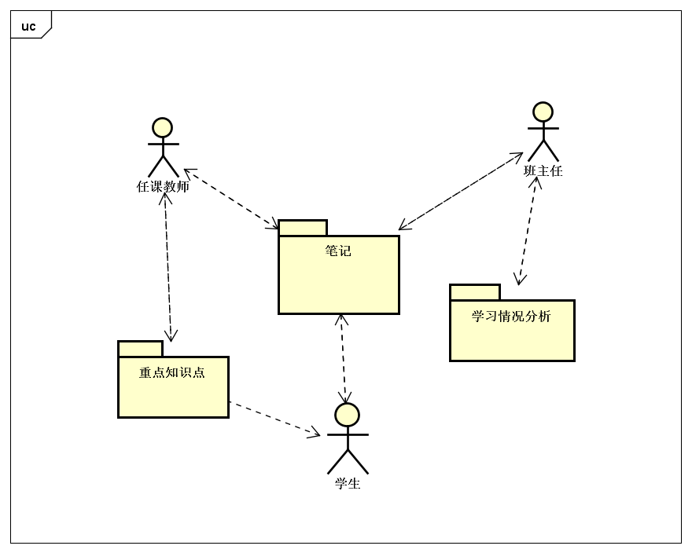

# 课堂笔记管理系统 前景和范围文档

By Trap x01

<!-- TOC -->

- [课堂笔记管理系统 前景和范围文档](#课堂笔记管理系统-前景和范围文档)
- [0. 更新日志](#0-更新日志)
- [1. 业务需求](#1-业务需求)
    - [1.1 应用背景](#11-应用背景)
    - [1.2 业务机遇](#12-业务机遇)
    - [1.3 业务目标与成功标准](#13-业务目标与成功标准)
        - [1.3.1 业务目标](#131-业务目标)
        - [1.3.2 成功标准](#132-成功标准)
    - [1.4 业务风险](#14-业务风险)
- [2. 项目前景](#2-项目前景)
    - [2.1 前景概述](#21-前景概述)
    - [2.2 主要特性](#22-主要特性)
    - [2.3 假设与依赖](#23-假设与依赖)
- [3. 项目范围](#3-项目范围)
    - [3.1 范围列表](#31-范围列表)
    - [3.2 限制与排除](#32-限制与排除)
- [4. 项目环境](#4-项目环境)
    - [4.1 操作环境](#41-操作环境)
    - [4.2 涉众](#42-涉众)
    - [4.3 项目属性](#43-项目属性)

<!-- /TOC -->

# 0. 更新日志

| 时间 | 修改人 | 版本号 | 理由 |
| -- | --- | -- | -- |
| 2018/10/3 | 陈俊达 | V1.0 | 第一版 |

# 1. 业务需求

## 1.1 应用背景

某高中在教学中发现，学生、任课老师、班主任在记录、管理、利用笔记和错题方便有很大的缺陷，花费了许多时间却不能达到预期地帮助学习（学生）、掌握学生知识掌握情况（任课老师）、掌握班级学习情况（班主任）的效果。

学生记录题目浪费时间，且难以在已有的笔记上进行修改。通过传统的分类方式将一道错题、一份笔记归类到一个类型里不够科学和全面，也不便于查找。

任课教师难以通过分散的学生错题和笔记情况得知学生的难点和易错点，也难以和其他老师交流教学经验。另外，教师长时间的教学经验积累了很多的笔记，这些笔记由于数量太多，不易保存和查阅。教室也不便于修改已有的笔记。

同样由于学生错题和笔记分布很分散，班主任很难通过笔记和错题来分析学生的学习情况，最终只能通过考试情况衡量学习质量。但是由于每个班级学生基本情况不同，每次考试的难易程度不同、着重点不同、偶然情况比较多（例如发挥失常/超常），仅使用考试情况衡量学习质量不够科学。

校长认为可以通过一个课堂笔记管理系统来改善现有的问题。

## 1.2 业务机遇

若帮助此高中搭建一个在线笔记系统，将能够解决应用背景里遇到的教学和学习过程中遇到的各个问题。学生能够更高效、省时省力地记录笔记，也访问通过关键词、分类等高效、快速地查找自己已有的笔记，还能够方便地借用其他同学的笔记；任课教师也可以有序地保存、更新、查找自己任教多年积累下来的教学经验，还能够快速或者应重点关注的知识点，科学地规划教学计划；班主任也可以通过笔记更加全面地了解整个班级的学习情况，从而科学地制定相应的策略。最终能够使教学和学习事半功倍，提高工作效率和教学质量，提高学习成绩和学校声誉。

## 1.3 业务目标与成功标准

### 1.3.1 业务目标

| 编号 | 简介 | 度量标准 | 计量方法 | 标准（理想，一般，最低） |
| --- | --- | -- | --- |--- |
| BO-1 | 在对应功能上线投入运行三个月后，减少用户在记录笔记上花费的时间 | 用户在记录笔记上花费的时间 | 随机采样采访，学生50名，教师班主任各10名 | ( -50%, -30%, -10%) |
| BO-2 | 在对应功能上线投入运行三个月后，减少用户在更新已有笔记上花费的时间 | 用户在更新已有笔记上花费的时间 | 随机采样采访，学生50名，教师班主任各10名 | (-70%, -50%, -10%) |
| BO-3 | 在对应功能上线投入运行三个月后，减少用户在查找错题和笔记的时间 | 随机采样30名学生，在投入系统使用前要求用户查找5个随机错题。系统投入使用后，要求这些学生把包含之前抽取的错题的一些错题记录到系统中，然后在三个月后再要求用户查找相同错题，统计此过程消耗的时间 | (-40%, -30%, -20%) |
| BO-4 | 在对应功能上线投入运行三个月后，学生能够在他人预先允许、且不影响他人的情况下自助地查看到他人的笔记；也能在他人允许的情况下，在笔记上通过评论、批注等方式与他人交流。| 是否能够熟练地做到查看、评论、批注他人笔记 | 随机采样10名同学，要求他们随机查看、评论和批注任意其他同学的任何一篇笔记，统计此过程花费的时间 | (30s, 1min, 2min) |
| BO-5 | 在对应功能上线投入运行三个月后，教师能够并采纳系统提取的关键知识点 | 随机选取10名教师，采访对系统提取的关键知识点的满意度 | (90%好评，50%好评，30%好评) |
| BO-6 | 在对应功能上线投入运行三个月后，班主任肯定系统提取的学生学习情况分析。 | 随机选取10名班主任，采访对系统分析的学生学习情况的满意度 | (90%好评，50%好评，30%好评) |

### 1.3.2 成功标准

| 编号 | 描述 |
| --- | --- |
| SC-1 | 在系统投入使用一个学期后，超过50%的学生、任课老师和班主任开始日常使用本系统。 |
| SC-2 | 在系统投入使用一个学期后，本系统上的笔记数量应超过人均5页。|
| SC-3 | 在系统投入使用一个学期后，进行一次对匿名的使用满意度调查，满意度至少达到90%。 |

## 1.4 业务风险

| 编号 | 描述 | 可能性 | 影响 |
| --- | --- | -- | -- |
| RI-1 | 学校不允许学生使用电子产品，影响学生对系统的使用效率 | 0.6 | 0.8 |
| RI-2 | 由于现有硬件的技术限制，使用电子设备记笔记的用户体验不如真正的纸笔，从而让用户不喜欢使用本系统 | 0.8 | 0.8 | 
| RI-3 | 系统分析得出的学习情况分析和重点知识点不准确，多次发生后，让用户产生不信任 | 0.8 | 0.4 |
| RI-4 | 由于时间紧张或者操作复杂等因素，用户不愿意学习使用本系统或者无法养成使用本系统的习惯 | 0.3 | 0.5 |

# 2. 项目前景

## 2.1 前景概述

本系统通过直截了当、利用了现代科技的、具备各种功能的笔记系统能够帮助教学和学习过程的涉众（即学生、任课教师和班主任）提高学习和工作的效率。用户可以使用更少的时间、通过文本、图片、视频、语音等方式更完整全面的记录、编辑、查找笔记，并能够更方便地将笔记与其他用户共享，从而更加高效地利用笔记这个课堂学习中必不可少的资料。除此之外，还提供学习情况分析和重点知识点分析两大功能帮助班主任和任课教师更科学全面地制定教学和管理计划，更有效地提高成绩。同时，本系统通过真实的走访调查，由真实的用户需求得来，解决了真正的教学痛点，得到了各个受众的强烈支持。

## 2.2 主要特性

FE-1: 系统记录保存使用者通过图片（并支持在图片上编辑（裁剪、旋转、标注、水印）），文本，音频、录像等方式上传的笔记

FE-2: 系统允许编辑已上传的错题和笔记

FE-3: 系统允许用户查看自己和他人笔记的历史版本

FE-4: 系统有自定义笔记分类功能，并能在一定程度上自动提取笔记的关键词

FE-5: 系统允许查看他人笔记

FE-6: 系统在他人笔记上评论和批注

FE-7: 系统允许用户设置分享和评论权限

FE-8: 系统应能为班主任提供班级管理功能，并能够进行学生学习情况分析。

FE-9：系统应能为任课教师提取应重点关注的知识点。

## 2.3 假设与依赖

# 3. 项目范围

## 3.1 范围列表

| 特性 | 版本1 | 版本2 | 版本3 |
| -- | -- | -- | -- |
| FE-1 | 能够支持主要特性FE-1里提到的完整功能 | | |
| FE-2 | 能够支持编辑已上传的错题和笔记 |  |  |
| FE-3 | 允许用户查看自己笔记的历史版本 | 允许用户查看他人笔记的历史版本 | |
| FE-4 | 支持自定义笔记分类功能 |  | 加入自动提取笔记关键词的功能 |
| FE-5 | 不实现 | 系统允许查看他人笔记 | 加入自然语言查找、搜索和推荐笔记的功能 | 
| FE-6 | 不实现 | 系统在他人笔记上评论和批注 | |
| FE-7 | 不实现 | 系统允许用户设置分享和评论权限 | |
| FE-8 | 不实现 | 实现班级管理 | 实现学生学习情况分析功能 |
| FE-9 | 不实现 | 不实现 | 实现提取应重点关注的知识点的功能 |

## 3.2 限制与排除

LI-1: 本系统针对的是面向高考的普通初中、高中学校，面向目标为中考和高考的普通学生；
LI-2: 本系统限制于传统的班级制管理模式（即在一段时间中一个班级有固定的一个班主任，每个班级每个课程有固定的任课老师）
LI-3: 本系统默认所使用电子设备支持键盘和触摸，有的功能需要触控笔的支持
LI-4: 本系统默认服务器搭建于互联网，共享、分析等功能需要互联网接入支持

# 4. 项目环境

## 4.1 操作环境

用户地理集中情况：所有用户都可在任意有能力接入互联网的地方使用本系统，包括家里、教室、宿舍、办公室等任意场所。

各类用户使用系统的时间状况：

| 涉众 | 使用时间状况 |
| -- | --- |
| 学生 | 大部分为下课时和放学后，若老师允许上课时间也可以使用 |
| 任课教师 | 备课时，例如没课的上课时间和休息时间 |
| 班主任 | 没课的上课时间和休息时间，或者上类似班会课的时间段（主要为获得分析数据） |

数据生成与使用情况

| 数据类型 | 生成出处 | 使用情况 |
| --- | --- | --- |
| 笔记和错题 | 学生，任课教师，班主任 | 学生，任课教师，班主任在权限设置允许的情况下均可访问 |
| 应重点关注的知识点 | 任课教师进行重点知识点分析 | 由任课教师查看并利用，制定课堂计划 |
| 班级学习情况分析表 | 班主任进行班级学习情况分析 | 由班主任查看并利用，制定响应策略 |

## 4.2 涉众

本系统内各类用户的交互图如下：

系统内涉众相关信息的具体说明如下：

| 涉众 | 特征 | 主要目标 | 态度 | 主要关注点 | 约束条件 |
| --- | --- | --- | --- | --- | --- |
| 学生 | 普遍具有电子设备使用经验，乐于接受新事物 | 能够高效记录和利用错题和笔记，提高学习成绩 | 强烈支持 | 保证系统的低学习成本和使用方便性 | 无 |
| 任课教师 | 负责教授课程，对学生的错题管理及成绩提高起直接性的作用 | 能高效地对学生的学习做到全面了解，掌握应重点关注的知识点，提升学生成绩 | 非常支持系统开发 | 能否直接对学生的学习情况进行有效的了解，能够方便快捷地获得应重点关注的知识点，以及能否方便地上传、更新笔记 | 无       |
| 班主任 | 具有班级管理能力 | 从整体上了解学生错题记录情况和学生学习情况 | 强烈支持 | 保证系统的低学习成本和使用方便性以及显示学习情况的整体性 | 无 |

与该软件系统直接相关的用户以及优先级评定： 

| 用户群体 | 任务 | 群体数量 | 优先级 |
| --- | --- | --- | --- |
| 学生 | 记录和查看错题 | 500 | 3 |
| 任课教师 | 上传笔记并能够进行修改和查阅 | 30  | 2      |
| 班主任 | 查看系统分析后的学生整体学习情况 | 20 | 1 |

## 4.3 项目属性

| 属性 | 执行者 | 约束因素 | 可调整因素 |
| ---- | ---- | --- | --- |
| 进度 |      | 计划在一个学期内完成第一版并开始使用，本学年内完成第二版和第三版。 |
| 特性 |    |  按项目范围所述，每个版本所涉及的特性都应完整实现。|   |
| 质量 | 按项目范围所述，每个版本所涉及的特性都应经过完整测试，保证可用性，保证在可能的最大压力下（即所有学生、任课教师和班主任同时使用）系统不会崩溃。 |  |
| 人员 |  |  |  开发团队规模可自由调整，但不超过10人。|