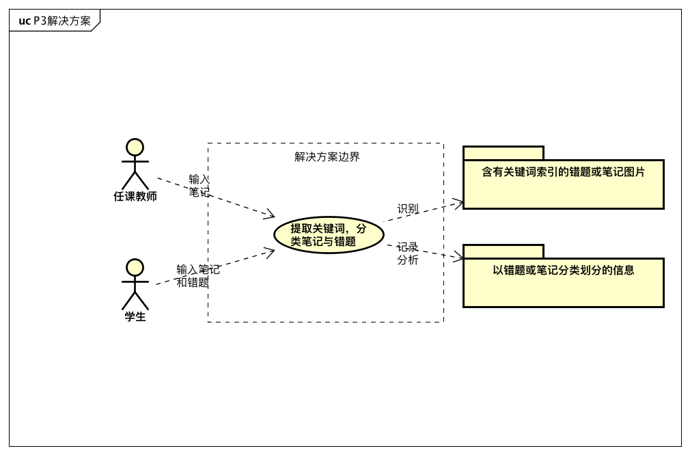

**1.2.达成共识**

| 要素   | 内容                                   |
| ------ | -------------------------------------- |
| ID     | P3                                     |
| 提出者 | 任课教师                               |
| 关联者 | 学生                                   |
| 问题   | 无法针对性地查找出某一部分的错题和笔记 |
| 影响   | 导致错题和笔记使用效果不灵活           |

**2.涉众分析**
**2.1. 涉众识别和描述**

| 涉众     | 特征                                                   | 主要目标                                       | 态度             | 主要关注点                                                   | 约束条件 |
| -------- | ------------------------------------------------------ | ---------------------------------------------- | ---------------- | ------------------------------------------------------------ | -------- |
| 任课教师 | 负责教授课程，对学生的错题管理及成绩提高起直接性的作用 | 能高效地对学生的学习做到全面了解，提升学生成绩 | 非常支持系统开发 | 能否直接对学生的学习情况进行有效的了解，以及能否方便地上传、更新笔记 | 无       |

**2.2涉众评估**

| 用户群体 | 任务                         | 群体数量 | 优先级 |
| -------- | ---------------------------- | -------- | ------ |
| 任课教师 | 上传笔记并能够进行修改和查阅 | 30       | 2      |

**3.发现业务需求**

| 要素   | 内容                                                    |
| ------ | ------------------------------------------------------- |
| ID     | P3                                                      |
| 提出者 | 任课教师                                                |
| 关联者 | 学生                                                    |
| 问题   | 无法针对性地查找出某一部分的错题和笔记                  |
| 影响   | 导致错题和笔记使用效果不灵活                            |
| 目标   | 在系统投入运行三个月后，查找错题和笔记的时间至少减少20% |

**4.定义解决方案及系统特性**

**4.1定义高层次的解决方案**

| 问题 | 解决方案                                                     |
| ---- | ------------------------------------------------------------ |
| P3   | * S1: 笔记可以自定义分类，而且每个笔记可以属于多个类型 * S2: 笔记应支持通过关键词、主题等较为方便的查找 |

| 要素 | 内容 |
| ---- | ---- |
| ID   | P3   |

解决方案：

| 方案描述 | 通过预先定义多种笔记的分类，以及图像文字识别，实现对关键词的提取及检索 |
| -------- | ------------------------------------------------------------ |
| 业务优势 | 错题及笔记分门别类，并是识别出其中的关键词，从而可以实现对笔记的模糊搜索，大大方便学生对笔记的搜索和使用效率，进而节省学习时间和成本，提高学习成绩 |
| 代价     | 实现图片转文字的大量软件费用，笔记分类的软件费用             |

**4.2确定系统特性和解决方案的边界**

| 针对的问题 | 解决方案需要具备的系统特性                                   |
| ---------- | ------------------------------------------------------------ |
| P3         | 系统有自定义笔记分类功能，并能对笔记关键词进行一定程度的提取 |

**4.3确定解决方案的约束**

P3:

| 约束源         | 约束                                         | 理由                                               |
| -------------- | -------------------------------------------- | -------------------------------------------------- |
| 操作性         | 任课教师与学生需及时上传每一笔记图片         | 系统需要图片式的技术及时输入以收集信息             |
| 系统及操作系统 | 系统提供良好的文字提取功能和                 | 只有正确提取了图片中关键词，才能开发更好的检索功能 |
| 设备预算       | 调用文字识别API或自己训练文字识别模型需要GPU | 文字识别的训练，需求算力较大，使用GPU加速训练      |
| 人员资源       | 不需要外部的人员，使用已有的员工             | 固定操作成本                                       |
| 技术要求       | 使用机器学习技术                             | 反复训练提高文字提取的正确率                       |

