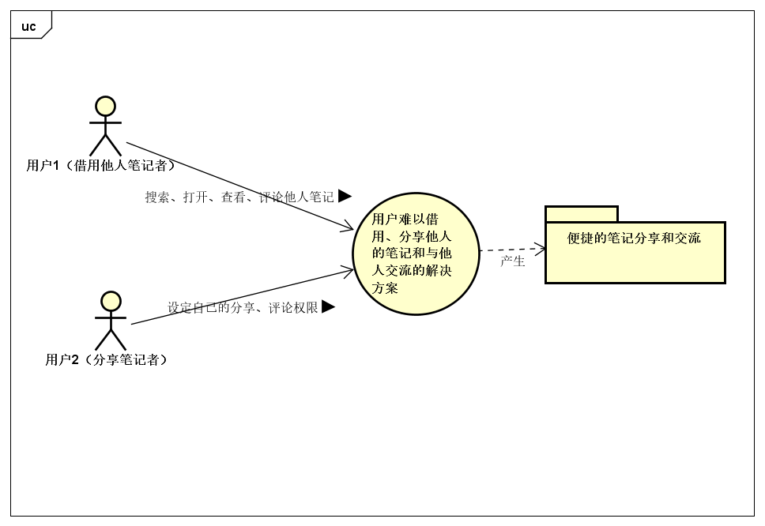

## 1.2 问题达成共识

| 要素 | 内容 |
| -- | --- |
| ID | P4 |
| 提出者 | 学生 |
| 关联着 | 学生，任课老师，班主任 |
| 问题 | 如果一个学生需要借用他人的笔记，他需要先获得他人的允许，并且需要打扰他人才能做到。借用和分享不够方便，也缺乏方便的分享和交流的渠道。 |
| 影响 | 学生难以借用他人的笔记，也不便于分享自己的笔记，影响了资源的充分利用。|

# 3. 发现业务需求

| 要素 | 内容 |
| -- | --- |
| ID | P4 |
| 提出者 | 学生 |
| 关联着 | 学生，任课老师，班主任 |
| 问题 | 如果一个学生需要借用他人的笔记，他需要先获得他人的允许，并且需要打扰他人才能做到。借用和分享不够方便，也缺乏方便的分享和交流的渠道。 |
| 影响 | 学生难以借用他人的笔记，也不便于分享自己的笔记，影响了资源的充分利用。|
| 目标 | 让学生能够在他人预先允许、且不影响他人的情况下自助地地查看到他人的笔记；也能在他人允许的情况下，在笔记上通过评论、批注等方式与他人交流。 |

# 4. 定义解决方案及系统特性

## 4.1 确定高层次的解决方案

| 问题 | 解决方案 |
| -- | -- |
| P4 | S1: 在他人允许的情况下，用户可以查看其他用户的笔记 S2: 在他人允许的情况下，用户可与他人通过评论、批注等方式进行交流 |

| 要素 | 内容 |
| --- | --- |
| ID | P4 |
| 解决方案描述 | 在他人允许的情况下，允许用户可以其他用户的笔记 |
| 业务优势 | 可以在不打扰他人的情况下借用到他人的笔记；也可以在不被打扰的情况下将笔记分享给其他人。|
| 代价 | 相关人员需要一定的软件培训成本，也需要用户事先确认自己的权限设置。 |

| 要素 | 内容 |
| --- | --- |
| ID | P4 |
| 解决方案描述 | 在他人允许的情况下，允许用户在其他用户的笔记上评论和批注。 |
| 业务优势 | 用户可以在参考笔记的时候自然地与其他用户交流，也不会影响他人。 |
| 代价 | 相关人员需要一定的软件培训成本，也需要用户事先确认自己的权限设置。 |

## 4.2 确定系统特性和解决方案的边界

| 针对的问题 | 解决方案需要具备的系统特性 |
| -- | -- |
| P4 | 系统增加查看他人笔记和在他人笔记上评论和批注的功能，并允许用户设置分享和评论权限，即是否分享、分享对象、是否允许评论等。|

## 4.3 确定解决方案的约束

P4
| 约束源 | 约束 | 理由 |
| --- | --- | --- |
| 操作性 | 用户能够在不接受太多培训的情况下操作系统  | 用户（尤其是学生）时间紧张，不会有太多时间花在学习如何使用系统上  |
| 系统和操作系统 | 系统需要能够运行在PC、手机、平板等多个平台  | 方便用户（尤其是学生）的使用  |
| 设备预算 | 系统在已架构好的服务器和主机上开发 | 控制成本，开发简单 |
| 人员资源 | 不需要外部的人员，使用已有的员工 | 固定操作成本 |
| 技术要求 | 良好的人机交互界面 | 方便用户使用 |