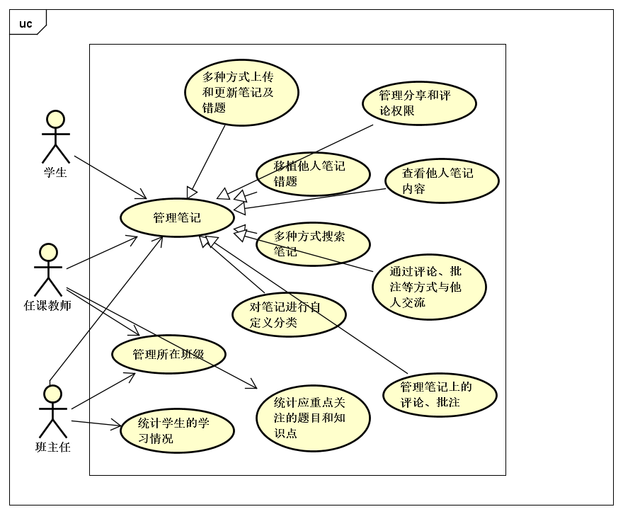

# 课堂笔记系统 用例文档

By Trap x01

# 0. 更新记录

| 日期 | 更改人 | 版本号 | 原因 |
| -- | -- | -- | -- |
| 2018.10.15 | 陈俊达 | V0.1 | 第一版 |

# 1. 引言

## 1.1 目的

本文档描述了课堂笔记系统的用例图及用例文档。

## 1.2 阅读说明

本文档包括用例列表、用例图、详细用户说明、需求列表以及跟踪矩阵。

用例描述的约定为包含用例 ID、名称、创建日期、最后一次更新日期、参与者、触发条件、前置条件、后置条件、优先级、正常流程、扩展流程特殊需求。其中流程完整有序地描述该用例中使用者与系统的交互。 

## 1.3 参考文献

《软件工程与计算（卷二）软件开发的技术基础》 
《需求工程——软件建模与分析（第二版）》 

# 2. 用例列表

| 参与者 | 用例编号 | 用例名称 |
| --- | ---- | ---- |
| 学生、任课教师和班主任 | 1 |多种方式上传和更新笔记及错题|
| 学生、任课教师和班主任 | 2 | 移植他人笔记错题 |
| 学生、任课教师和班主任 | 3 | 对笔记进行自定义分类 |
| 学生、任课教师和班主任 | 4 | 多种方式搜索笔记 |
| 学生、任课教师和班主任 |  5        | 查看他人笔记内容               |
| 学生、任课教师和班主任 |   6       | 通过评论、批注等方式与他人交流 |
|学生、任课教师和班主任  | 7 |管理笔记上的评论、批注|
|学生、任课教师和班主任| 8 |管理分享和评论权限|
| 任课教师和班主任 | 9 | 管理所在班级 |
| 任课教师 | 10 |  统计应重点关注的题目和知识点  |
| 班主任 | 11 | 统计学生的学习情况 |

# 3. 用例图

# 4. 详细用例描述

# 5. 用户需求列表

## 5.1 业务需求

BR1: 使用该系统后，学生、任课教师和班主任花费在记录、更新笔记错题上的时间减少，记录和更新笔记的方式增加。

BR2: 使用该系统后，学生、任课教师和班主任话费在查找错题和笔记上的时间显著减少。

BR3: 使用该系统后，让学生能够在他人预先允许、且不影响他人的情况下自助地查看到他人的笔记；也能在他人允许的情况下，在笔记上通过评论、批注等方式与他人交流。

BR4: 系统允许班主任和任课教师管理自己所在班级的成员。

BR5: 系统允许教师快速提取应重点关注的知识点。

BR6: 系统允许班主任通过系统的统计初步掌握学生的学习情况。

## 5.2 用户需求

UR1: 学生、任课教师和班主任可以通过手动录入、拍照识别、音频识别的方式记录、更新笔记错题

UR2: 学生、任课教师和班主任可以通过系统移植他人的笔记和错题

UR3: 学生、任课教师和班主任可以对笔记和错题进行自定义分类

UR4: 学生、任课教师和班主任可以通过输入文字、拍照来搜索错题和笔记

UR5: 学生、任课教师和班主任可以通过系统自动提取的关键字来查阅和定位关键内容

UR6: 学生可以通过系统向他人申请查看他人的笔记内容

UR7: 学生可以通过系统处理他人申请查看的消息

UR8: 学生在可以通过系统查看他人的笔记内容

UR9: 学生在可以通过评论、批注等方式在他人笔记上进行交流

UR10: 学生可以通过系统管理他人在自己笔记上留下的评论和批注

UR11: 任课教师应可以通过系统统计任课班级被学生记录的题目的数量和学生标记的题目的重要程度，提取出应重点关注的题目和对应的需要重点关注的知识点。

UR12: 班主任应该可以通过系统统计某个具体学生在某个时间区间记录笔记的数量、频率判断出此学生在这段学生的学习情况。

# 6. 跟踪矩阵

