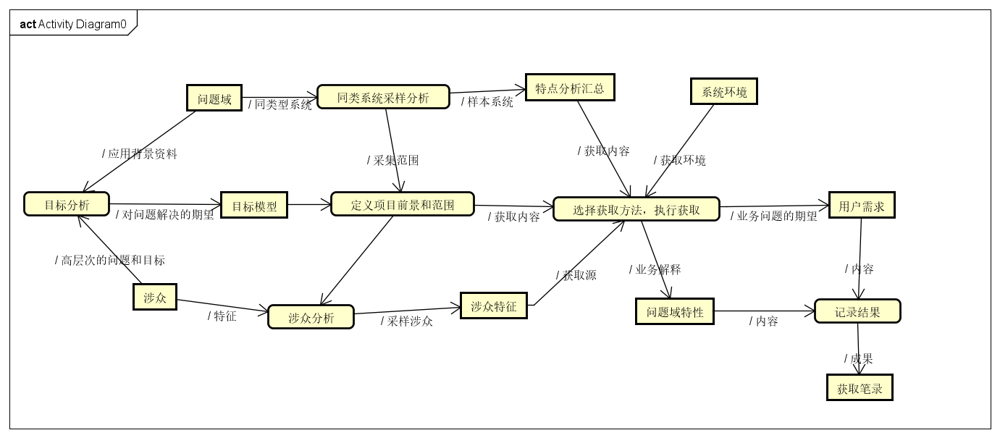
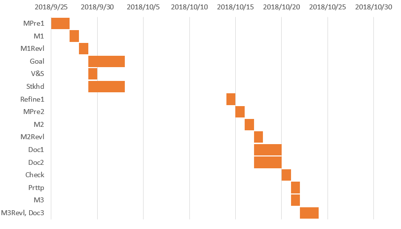

# 课堂笔记系统 需求获取安排计划书

By Trap x01

<!-- TOC -->

- [课堂笔记系统 需求获取安排计划书](#课堂笔记系统-需求获取安排计划书)
- [0. 更新记录](#0-更新记录)
- [1. 引言](#1-引言)
    - [1.1 编制目的](#11-编制目的)
    - [1.2 词汇表](#12-词汇表)
    - [1.3 参考资料](#13-参考资料)
- [2. 需求获取计划概要](#2-需求获取计划概要)
    - [2.1 需求获取活动](#21-需求获取活动)
    - [2.2 需求获取流程](#22-需求获取流程)
    - [2.3 需求获取时间轴](#23-需求获取时间轴)
- [3. 需求获取各阶段明细](#3-需求获取各阶段明细)
    - [3.1 研究应用背景，建立知识框架](#31-研究应用背景建立知识框架)
    - [3.2 目标分析，获取项目前景和范围](#32-目标分析获取项目前景和范围)
    - [3.3 选择获取方法](#33-选择获取方法)
        - [3.3.1 半结构化面谈](#331-半结构化面谈)
            - [3.3.1.1 方法描述](#3311-方法描述)
            - [3.3.1.2 不选择原因](#3312-不选择原因)
        - [3.3.2 结构化面谈](#332-结构化面谈)
            - [3.3.2.1 方法描述](#3321-方法描述)
            - [3.3.2.2 选择理由](#3322-选择理由)
        - [3.3.3 纸质原型](#333-纸质原型)
            - [3.3.3.1 方法描述](#3331-方法描述)
            - [3.3.3.2 选择理由](#3332-选择理由)
        - [3.3.4 场景串联图板](#334-场景串联图板)
            - [3.3.4.1 方法描述](#3341-方法描述)
            - [3.3.4.2 不选择理由](#3342-不选择理由)
        - [3.3.5 交互式原型](#335-交互式原型)
            - [3.3.5.1 方法描述](#3351-方法描述)
            - [3.3.5.2 不选择理由](#3352-不选择理由)
        - [3.3.6 其他](#336-其他)
    - [3.4 执行获取](#34-执行获取)
        - [3.4.1 获取计划](#341-获取计划)
        - [3.4.2 甘特图](#342-甘特图)
- [4. 跟踪和反馈](#4-跟踪和反馈)

<!-- /TOC -->

# 0. 更新记录

| 日期 | 更改人 | 版本号 | 原因 |
| -- | -- | -- | -- |
| 2018.10.14 | 陈俊达 | V0.1 | 第一版 |

# 1. 引言

## 1.1 编制目的

本文档是需求小组在进行需求工程实践中在需求获取阶段的产物，作用于整个需求获取阶段，主要描述了需求获取阶段的全程计划安排，作为执行指南和后续跟踪管理的依据。

## 1.2 词汇表

| 用语 | 解释 |
| -- | -- |
| MPre | 面谈准备 |
| M | 面谈 |
| Goal | 目标 |
| Stkhd | 涉众 |
| V&S | 前景和范围 |
| MRevl | 面谈分析 |
| Refine | 精化 |
| Prttp | 原型 |
| Doc |文档 |
| Check | 评审 |

## 1.3 参考资料

骆斌，丁二玉.需求工程------软件建模与分析[M].北京：高等教育出版社，2009:1-112

# 2. 需求获取计划概要

## 2.1 需求获取活动

在进行了对上一阶段形成的目标模型的进一步审查和分析之后，综合考量系统的高层目标，系统的受众和应用场景，我们任务在整个需求获取当中应该进行以下活动。

- 研究应用背景，分析现有类似系统，建立初始知识框架
- 分析系统高层目标，建立目标模型
- 寻找相关涉众，进行涉众分析和涉众选择
- 根据目标模型，涉众特点，选择具体获取方法
- 先行确定获取活动的内容和主题，设定场景，执行需求获取具体活动
- 对需求获取具体活动的结果进行记录，分析和汇总
- 结合场景方法，进行用例分析，获得阶段制品即用例文档和用户需求列表

## 2.2 需求获取流程

## 2.3 需求获取时间轴

| 活动 | Deadline |
| -- | -- |
| 背景和知识框架 | 2018/10/1 |
| 目标模型 | 2018/10/5 |
| 涉众分析与前景范围 | 2018/10/10 |
| 选择获取方法 | 2018/10/13 |
| 执行获取 | 2018/10/15 |
| 获取结果 | 2018/10/23 |

# 3. 需求获取各阶段明细

## 3.1 研究应用背景，建立知识框架

需求小组首先对本系统的目标用户——中学阶段的学生、任课教师和班主任对笔记和错题管理这个问题的解决方案进行了分析，选择了一些已有的笔记和错题系统（OneNote、小猿搜题等）进行了使用和分析，结合我们自己中学阶段的经验，完成了对应用背景的研究和知识框架的建立。

## 3.2 目标分析，获取项目前景和范围

小组在应用背景的基础上首先进行了简单的问题分析，由问题入手，得到了高层次的系统目标，然后通过目标模型的分析方法，进行了目标建模，其间进行了基于目标的涉众分析并且最终形成了项目前景和范围文档，具体过程和产物请参考《课堂笔记管理系统 过程分析文档》和《课堂笔记系统 前景和范围文档》。

## 3.3 选择获取方法

通过对涉众的特点和项目的目标、前景与范围以及成本等方面的综合考虑，我们选择了如下方法进行需求的具体获取，主要采取的是**面谈**方法，面谈是需求获取的经典方法，几乎所有项目都采取面谈获取需求，这也是我们主要的获取方法，它具有成本低，实践容易，提高涉众参与度等优点。针对面谈方法使用中可能存在的概念结构不同、模糊化描述、默认知识、潜在知识等现象，我们可能会使用原型方法作为补充手段，用于对细节和复杂部分的细化和分析。

以下是各个获取方法的描述，以及选择或者不选择的原因。

### 3.3.1 半结构化面谈

#### 3.3.1.1 方法描述

在项目的初期阶段，我们主要以获取的知识框架为基础，进行详细的问题准备，但是选择的问题叙述方式较为多样化，主要用于获取高层次的目标和特性，逐步建立系统的功能需求框架，在此框架的基础上处理逐步细化的探索性问题。

随着需求获取的逐渐深入，每次给出的基础性框架更为明确，探索性问题的针对性和细节性更强，面谈的结构化程度逐渐增强，逐步穿插界面原型，场景方法和故事板方法，已经能够处理绝大多数的需求获取任务。

#### 3.3.1.2 不选择原因

由于此方法效率不高，以及我们已有对此问题有足够的了解，我们不采用半结构化面谈的方法。

### 3.3.2 结构化面谈

#### 3.3.2.1 方法描述

在需求获取的前半段，对问题域知识不够了解、对用户需求不够了解的情况下，我们使用结构化面谈的方法获取需求的高层次目标和特性，获得系统的业务需求。

在需求获取的后期阶段，在用例初稿和用户需求列表初步形成之后，我们使用结构化面谈的方法，逐条对需求初步产物进行审查，形成反馈，进行查缺补漏工作，同时用户在需求获取评审的参与方法。

#### 3.3.2.2 选择理由

结构化面谈是一个高效率、易使用、在各个阶段都适用的需求获取方法。我们主要采取此方法以高效准确地获取需求。

### 3.3.3 纸质原型

#### 3.3.3.1 方法描述

在项目前景和范围以及确定之后，开始逐步细化用户需求，我们采用了用例和场景的组织方法，首先得到了多个场景，形成了系统用例图，然后以此为依据，明确系统和用户之间的交互，在这个阶段，使用了纸质原型，主要以水平层次的原型为主，主要采取手绘界面原型，获得初步的功能模块和场景流程。

#### 3.3.3.2 选择理由

原型方法在应对需求的不确定性方面有着很好的表现，而且本系统致力于能够用于相较于同类系统有一定独特性或者优势的特性，所以需要使用原型进行探索，在初期不确定性很高的时候，选择使用成本最低的纸质原型，而且应用于直接与用户进行交流的情境下，修改更为方便，效率更高。纸质原型还可以用在小组内部交流和统一思想上。

### 3.3.4 场景串联图板

#### 3.3.4.1 方法描述

使用在线故事板构建网站https://www.storyboardthat.com进行场景串联图板的建立，主要是将场景式的互动通过图形描述展现给用户，通过对用户反馈的收集和分析，进行进一步的需求明确。第一版本原型展现的是静态画面，不具有动态性，难以和评估者进行明显的互动，所以我们采用交互性介于动态程序和静态画面之间的场景串联图板，这样可以把各个画面相互联系起来，描述复杂的情节和步骤，并易于发现用户容易遗漏或者习以为常的交互序列，同时使用storyboardthat.com构建的场景串联图板，成本较低，制作简单，比较理想。

#### 3.3.4.2 不选择理由

场景串联图板能够动态地展示需求，但是其成本较高，且客户对目标系统并没有一个完整的图像。所以，我们在本阶段不使用本方法。我们可能会在以后的某个阶段在小组内部使用本方法。

### 3.3.5 交互式原型

#### 3.3.5.1 方法描述

在前两版原型进行了客户反馈分析和改进之后，使用AxureRP进行交互式原型的构建，此次原型基本形成最终应用的功能框架和外部特征，与用户会面，请用户进行使用，获得用户反馈，进行改进。

#### 3.3.5.2 不选择理由

本方法是场景串联图板方法的进一步扩充，通过更高的成本以获取更精确、更接近最终系统的原型。同样是由于成本和客户的原因，我们不采用本方法。我们可能会在以后的某个阶段（例如UI设计阶段）在小组内部使用此方法。

### 3.3.6 其他

由于项目的成本的限制以及系统特性，不采取观察和文档审查的方法进行需求获取。

## 3.4 执行获取

### 3.4.1 获取计划

| 活动ID | 活动名称 | 活动内容 | 预计完成时间 | 负责人 |
| -- | -- | -- | -- | -- |
| MPre1 | 收集背景资料 | 对系统产生的背景进行深入了解剖析，为后续做好准备。 | 2018/9/26 | 所有人 |
| M1 | 面谈 | 第一次面谈，明确问题，了解系统使用场景、前景和范围 | 2018/9/27 | 王宁一 |
| M1Revl | 面谈总结 | 对第一次面谈的总结和细化。 | 2018/9/28 | 所有人 |
| Goal | 目标分析 | 整理第一次面谈的结果，进行问题分析，目标建模 | 2018/10/2 | 所有人 |
| V&S | 前景和范围定义 | 根据第一次面谈的结果，定义前景和范围 | 2018/10/2 | 所有人 |
| Stkhd | 涉众分析 | 进行基于目标模型的涉众分析 | 2018/10/2 | 张凌哲，王宁一，梁楠 |
| Refine1 | 精化需求 | 整理需求，精化需求，发现细节问题 | 2018/10/14 | 所有人 |
| MPre2 | 面谈材料和流程准备 | 整理细节问题，准备第二次面谈列表 | 2018/10/15 | 所有人 |
| M2 | 面谈 | 再次面谈，完善细节问题 | 2018/10/16 | 王宁一 |
| M2Revl | 面谈总结 | 对第二次面谈进行审查和交流，整理用户需求列表 | 2018/10/17 | 所有人 |
| Doc1 | 编写面谈报告文档 | 对两次面谈进行总结，整理面谈报告文档 | 2018/10/19 | 王宁一，陈俊达 |
| Doc2 | 编写文档 | 编写用例文档等其他文档 | 2018/10/19 | 所有人 |
| Check | 评审 | 对文档进行评审 | 2018/10/20 | 所有人 |

### 3.4.2 甘特图

 

# 4. 跟踪和反馈

我们使用表格记录需求获取计划和执行情况。

| 活动ID | 预计执行时间 | 实际执行时间 | 备注 |
| -- | -- | -- | -- |
| MPre1 | 2018/9/26 | 2018/9/27 | 队伍内部时间冲突 |
| M1 | 2018/9/27 | 2018/9/27 | |
| M1Revl | 2018/9/28 | 2018/9/28 | 人数不齐 |
| Goal | 2018/10/2 | 2018/9/29 | |
| V&S |  2018/10/2 | 2018/10/2 | |
| Stkhd |  2018/10/2 | 2018/10/1 | |
| Refine1 | 2018/10/14 | 2018/10/14 | |
| MPre2 | 2018/10/15 | 2018/10/15 | |
| M2 | 2018/10/16 | 2018/10/15 | 客户时间安排调整 |
| M2Revl | 2018/10/17 | 2018/10/16 | M2提前，总结也提前 |
| Doc1 | 2018/10/19 | | |
| Doc2 | 2018/10/19 | | |
| Check | 2018/10/20 | | |
