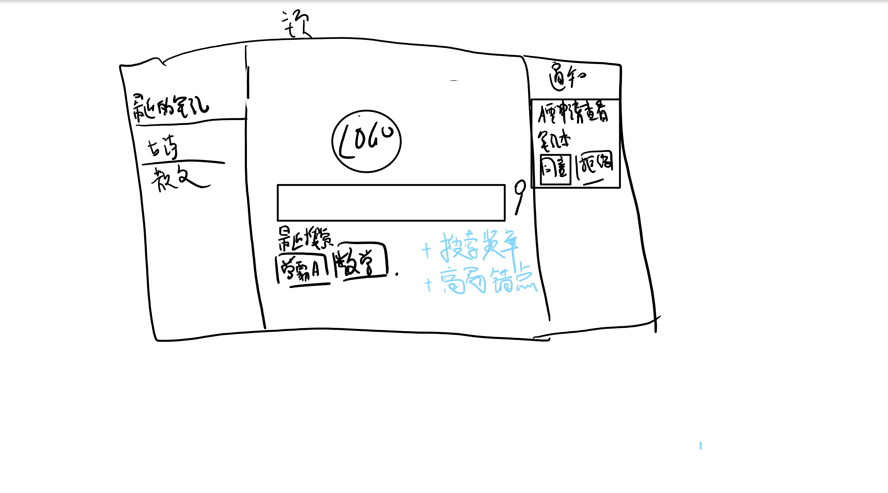
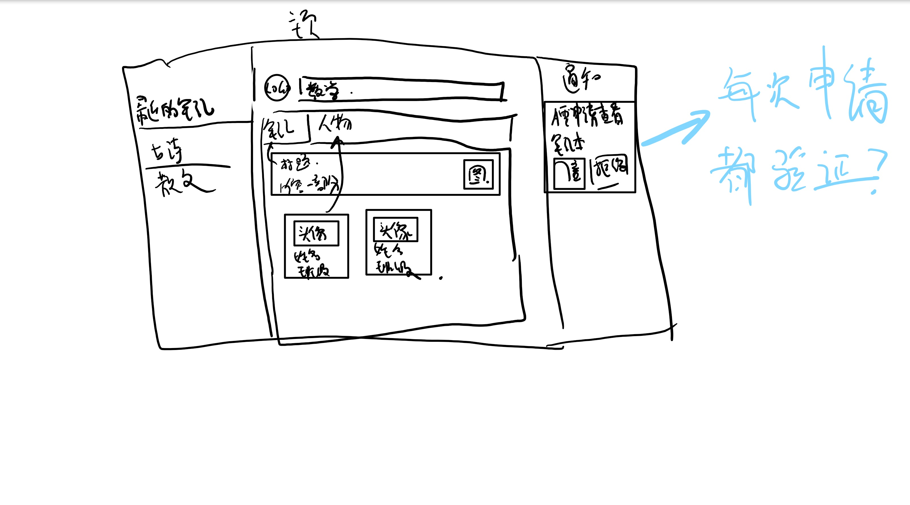
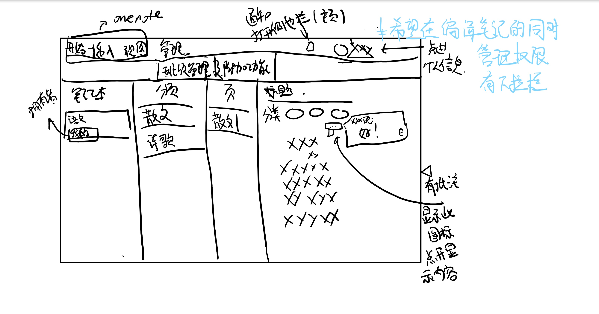
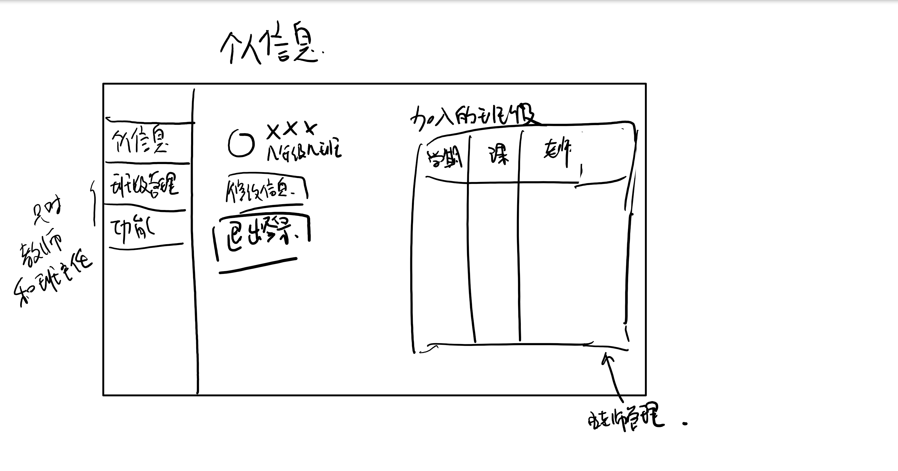
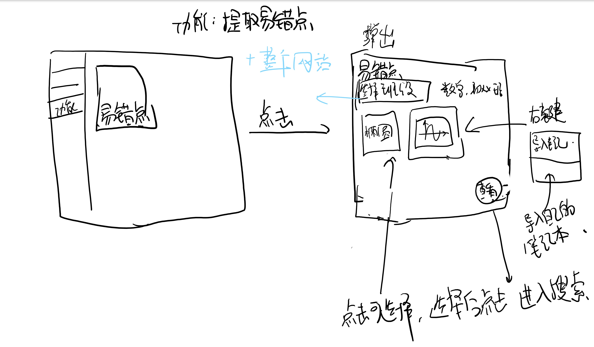
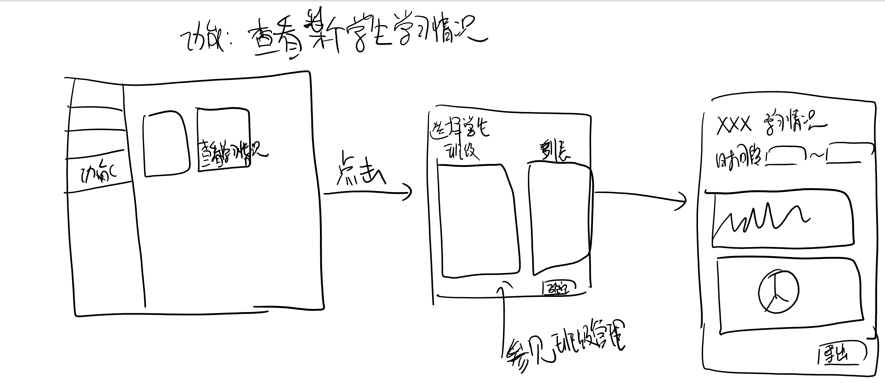

# 课堂笔记系统 面谈和原型使用报告

By Trap x01

<!-- TOC -->

- [课堂笔记系统 面谈和原型使用报告](#课堂笔记系统-面谈和原型使用报告)
- [0. 更新记录](#0-更新记录)
- [1. 引言](#1-引言)
  - [1.1 文档目的](#11-文档目的)
  - [1.2 文档内容概要](#12-文档内容概要)
  - [1.3 目标读者](#13-目标读者)
- [2. 面谈报告](#2-面谈报告)
  - [2.1 第一次面谈](#21-第一次面谈)
    - [2.1.1 产生背景](#211-产生背景)
    - [2.1.2 面谈目的](#212-面谈目的)
    - [2.1.3 面谈对象](#213-面谈对象)
    - [2.1.4 面谈类型和面谈结构](#214-面谈类型和面谈结构)
    - [2.1.5 面谈问题](#215-面谈问题)
    - [2.1.6 面谈过程](#216-面谈过程)
      - [2.1.6.1 面谈基本信息](#2161-面谈基本信息)
      - [2.1.6.2 面谈内容](#2162-面谈内容)
      - [2.1.6.3 谈话要点](#2163-谈话要点)
  - [2.2 第二次面谈](#22-第二次面谈)
    - [2.2.1 产生背景](#221-产生背景)
    - [2.2.2 面谈目的](#222-面谈目的)
    - [2.2.3 面谈对象](#223-面谈对象)
    - [2.2.4 面谈类型和面谈结构](#224-面谈类型和面谈结构)
    - [2.2.5 面谈问题](#225-面谈问题)
    - [2.2.6 面谈过程](#226-面谈过程)
      - [2.2.6.1 面谈基本信息](#2261-面谈基本信息)
      - [2.2.6.2 面谈内容](#2262-面谈内容)
      - [2.2.6.3 谈话要点](#2263-谈话要点)
  - [2.3 第三次面谈](#23-第三次面谈)
    - [2.3.1 产生背景](#231-产生背景)
    - [2.3.2 面谈目的](#232-面谈目的)
    - [2.3.3. 面谈对象](#233-面谈对象)
    - [2.3.4 面谈类型和面谈结构](#234-面谈类型和面谈结构)
    - [2.3.5 面谈问题](#235-面谈问题)
    - [2.3.6. 面谈过程](#236-面谈过程)
      - [2.3.6.1 面谈基本信息](#2361-面谈基本信息)
      - [2.3.6.2 面谈内容](#2362-面谈内容)
      - [2.3.6.3 谈话要点](#2363-谈话要点)
    - [2.3.7 原型图结果](#237-原型图结果)

<!-- /TOC -->

# 0. 更新记录

| 日期 | 更改人 | 版本号 | 原因 |
| -- | -- | -- | -- |
| 2018.10.18 | 陈俊达 | V0.1 | 第一版，增加第一次面谈 |
| 2018.10.19 | 王宁一 | V0.2 | 第二版，增加第二次面谈 |
| 2018.10.23 | 陈俊达 | V1.0 | 第三版，增加第三次面谈 |

# 1. 引言

## 1.1 文档目的

面对面的会见（face-to-face meeting）被认为是最具丰富内容的交流方法，同时实践当中应用 最为广泛的需求获取方法之一。同时，通过面谈可以获得的很多信息内容。其中包括：事实 和问题，被会见者的观点，被会见者的感受，组织和个人的目标等信息。

本报告旨在通过面对面的会见，从而获取构建校园有偿任务信息平台所需要的各类信息。从 而可以细化解决方案中遇到的一些问题，在存在问题的方面与用户之间达成共识，确定该项目的解决方案。 

在面谈过程中，我们使用了原型来更直观、更形象地与客户进行交流。所以在报告中，增加了原型的描述已经在面谈中使用原型的报告。

## 1.2 文档内容概要

本文档主要是需求工程活动中的整个面谈过程为主要内容。通过叙述面谈过程中的原型（如果有）、面谈计划，面谈过程，面谈报告以及参考内容。其中内容主要以笔录和电子文档等方式进行面谈过程的记录工作。 

## 1.3 目标读者

系统需求获取团队：本次需求活动的主要负责方，获取校园有偿任务信息平台的需求。

系统需求分析团队：根据获取的需求，进行需求的分析。

系统客户：需求的主要来源，同时，需要与其迚行需求的确认的工作。  

面谈参与人员：通过与原定面谈进行对比，从而进行总结经验，调整下次面谈内容。   

# 2. 面谈报告

## 2.1 第一次面谈

### 2.1.1 产生背景

某高中在教学中发现，学生、任课老师、班主任在记录、管理、利用笔记和错题方便有很大的缺陷，花费了许多时间却不能达到预期地帮助学习（学生）、掌握学生知识掌握情况（任课老师）、掌握班级学习情况（班主任）的效果。

学生记录题目浪费时间，且难以在已有的笔记上进行修改。通过传统的分类方式将一道错题、一份笔记归类到一个类型里不够科学和全面，也不便于查找。

任课教师难以通过分散的学生错题和笔记情况得知学生的难点和易错点，也难以和其他老师交流教学经验。另外，教师长时间的教学经验积累了很多的笔记，这些笔记由于数量太多，不易保存和查阅。教室也不便于修改已有的笔记。

同样由于学生错题和笔记分布很分散，班主任很难通过笔记和错题来分析学生的学习情况，最终只能通过考试情况衡量学习质量。但是由于每个班级学生基本情况不同，每次考试的难易程度不同、着重点不同、偶然情况比较多（例如发挥失常/超常），仅使用考试情况衡量学习质量不够科学。

校长认为可以通过一个课堂笔记管理系统来改善现有的问题。

我们认为这个需求比较抽象，需要与客户进行一次深入的交流以摸清客户的这个问题真正的看法和想象中的解决方案。

### 2.1.2 面谈目的

1. 确认系统使用者
2. 确认此高中目前的笔记和错题记录方式以及使用者对此的意见
3. 初步了解系统使用者对本系统的期望

### 2.1.3 面谈对象

客户：涂斌砚

### 2.1.4 面谈类型和面谈结构

本次面谈主要是了解客户对此系统的想法，故主要采用开放式（Open-ended）问题。

### 2.1.5 面谈问题

1. 系统的使用者有哪些
2. 你们认为现有使用者是如何记录、管理和使用错题和笔记的？
3. 现在的解决方案有哪些问题和缺陷？
4. 对未来发展的希望和一些措施

### 2.1.6 面谈过程

#### 2.1.6.1 面谈基本信息

| 信息 | 值 |
| -- | -- |
| 参与人员 | 项目方：王宁一（项目成员）；客户方：涂斌砚 |
| 时间 | 2018/9/27 |
| 地点 | 宿舍 |
| 面谈方式 | 通过面对面的会见的方式，同时通过笔录等方式进行面谈内容记录。 |

#### 2.1.6.2 面谈内容

问：系统的使用者有哪些

答：班主任、任课教师、学生

问：你们认为现有使用者是如何记录、管理和使用错题和笔记的？

答：学生：一个本子一个学科，出现错题就记录到错题本上，记满换一本；任课老师：按照教学方案、讲课顺序等记录，逢考试或练习记录同学们错误率较高的题目；班主任：主要使用考试情况衡量学生学习情况，未使用错题和笔记

追问1：那班主任在哪些地方使用错题和笔记呢？

答：班主任可能和任课老师一样在自己的课堂教学笔记上使用错题和笔记吧。

问：现在的解决方案有哪些问题和缺陷？

答：对学生来说，普通的笔记本通过科目来分类。但是错题出现的随机性导致很难找到特定类型的错题；第二，笔记本太多，错题较少的科目笔记本利用程度不高；第三：手抄题目浪费时间精力，剪切试卷影响试卷保存；第四，同学们迫切需要参考他人(成绩好的同学)的错题和笔记，但是在安静的课堂上借用其他人的笔记是一件比较麻烦的事。

答：对教师来说，现在很难通过学生的笔记情况获取学生的难点和易错点。同样，教师间迫切需要更方便交流教学经验。另外，由于教师教学时间长，积累了很多的笔记。而纸质的笔记不易保存和查阅。最后，像普通笔记一样，更新笔记较为困难(标注杂乱没有地方等) 。

答：对班主任来说，由于每个班级学生基本情况不同，每次考试的难易程度不同、着重点不同、偶然情况比较多（例如发挥失常/超常），仅使用考试情况衡量学习质量不够科学；另外，错题和笔记过于分散和个人化，难以集中起来科学分析掌握学生学习情况。

追问1：教师若不通过学生笔记情况来获得易错点，那目前是通过什么渠道？

答：目前教师是通过作业和考试来掌握易错点的。

追问2：这个方法听上去挺有道理的，有什么缺陷呢？

答：作业中的错题具有偶然性，例如有的出得比较坑的题目知识点比较偏门，或者问法过于奇怪，这种题目并不能被算着易错点；而学生笔记中的错题可以看作是学生过滤过觉得自己需要重点关注的题目，这样的题目可以真正表现出在学生心中真正的易错点。

问：对未来发展的希望和一些措施？

答：希望这个系统能够让用户用多种方式记录、上传笔记；希望能够方便老师和学生更新笔记，且能够查阅历史情况；希望能够便于分类和查找笔记和错题；希望能够便于使用者参考他人错题和笔记并交流。

#### 2.1.6.3 谈话要点

| 要点 | 被会见者观点 |
| -- | -- |
| 系统使用者 | 班主任，任课教师，学生 |
| 目前的解决方案 | 纸质错题本记录笔记和错题；通过作业和考试掌握易错点和学生学习情况 | 
| 目前解决方案的缺陷 | 学生：分类和查找不方便，抄写题目费时费力，更新笔记不便，不方便共享 教师：难以通过学生笔记情况获得易错点；大量的笔记难以保存和更新； 班主任：仅通过考试情况无法科学掌握学习情况，学生笔记过于分散和个人化，不方便利用起来掌握学习情况 | 
| 对未来发展的希望 | 多种方式记录和更新笔记；能够查阅笔记历史记录；方便分类和查找；方便共享；方便易错点统计和学习情况统计 |

## 2.2 第二次面谈

### 2.2.1 产生背景

在第一次面谈之后，我们根据面谈中得到的客户的需求整理出了一份想象中的解决方案列表，经过小组讨论，项目参与人员认为需要对部分不甚清楚的细节进行追问，对不太明确的需求进行探讨，了解系统使用者真实的看法和期望。

### 2.2.2 面谈目的

1. 明确上次面谈中模糊的问题
2. 评估和明确各个问题的解决方案

### 2.2.3 面谈对象

客户：涂斌砚

### 2.2.4 面谈类型和面谈结构

本次面谈主要是为了明确细节，抓住主题和线索，故主要采用封闭式问题。

### 2.2.5 面谈问题

1. 学校是否会给学生提供设备？
2. 系统面向学校内部还是准备推广到其他学校？
3. 是否希望学生之间能共享笔记？希望哪些角色能互相分享笔记？是否允许评论？
4. 如果因为硬件质量、使用习惯等原因用户不愿使用此系统，如何处理？

### 2.2.6 面谈过程

#### 2.2.6.1 面谈基本信息

| 信息 | 值 |
| -- | -- |
| 参与人员 | 项目方：王宁一（项目成员）；客户方：涂斌砚 |
| 时间 | 2018/10/16 |
| 地点 | 宿舍 |
| 面谈方式 | 通过面对面的会见的方式，同时通过笔录等方式进行面谈内容记录。 |

#### 2.2.6.2 面谈内容

问：学校是否会给学生提供设备？

答：不提供

问：系统面向学校内部还是准备推广到其他学校？

答：准备先在校内进行推广使用，随后推广到校外

问：是否希望学生之间能共享笔记？希望哪些角色能互相分享笔记？是否允许评论？

答：在取得用户本人的许可下，希望学生之间可以交流；教师始终可以查看学生笔记和错题；允许评论功能

问：如果因为硬件质量、使用习惯等原因用户不愿使用此系统，如何处理？

答：不使用也不会影响正常的教学活动的开展，同时及时把问题反馈给开发者

追问1：学校是否允许学生携带电子设备？

答：未来可能有这方面的考虑

追问2：学生应可以在什么设备上查看笔记和错题？

答：手机（含iOS和Android），网页

追问3：系统除了提供对文本的支持，还需要对什么输入方式（例如手写、笔写、照片、声音等）提供支持？

答：手/笔写，照片，声音

追问4：学校信息化程度如何？对系统有何限制？

答：教师办公室人手配备台式电脑并且预装win 10，对人机交互要求比较高，希望有友善的人机交互界面

追问5：学校对支撑系统运行的硬件和资金预算如何安排？

答： 一年可以在服务器上花费5万人民币左右

追问6：考虑到学生隐私问题，是否允许学生不分享自己的笔记和错题数据？

答：允许，但不推荐对老师不开放

追问7：系统投入使用后，学校计划如何推广本系统？

答：向老师和同学们大力推广，现在两个班试点，一个季度内推广到全校使用

#### 2.2.6.3 谈话要点

| 要点 | 被会见者观点 |
| -- | -- |
| 系统的维护和推广 | 需要有合适的IT管理人员，并配合现实情况，如客户的合理反馈等对系统及时加以功能调整 |
| 人员使用 | 需要满足学生放学后高效集中整理错题的需求，并用良好的人机交互服务用户 |
| 系统适配环境 | 需要照顾教师和学生对电脑、不同系统的手机的协调使用问题 |
| 隐私与管理 | 需要注意使用者隐私，确保用户的数据处于绝对安全地位，由负责任的系统管理员进行管理 |

## 2.3 第三次面谈

### 2.3.1 产生背景

第二次面谈后我们知道了更多的项目使用情况和需求的相关信息，并整理出了部分用例文档。为了更形象地确认我们理解的需求和用户的需求是否契合，我们还做出了一些原型图。我们认为需要将这些原型图给用户查看，获得他们的意见。

### 2.3.2 面谈目的

给用户展示目前的原型图，并获得他们的修改意见。

### 2.3.3. 面谈对象

客户：涂斌砚

### 2.3.4 面谈类型和面谈结构

本次面谈主要是为了获得用户的意见，故主要使用开放性问题。

### 2.3.5 面谈问题

展示和介绍原型图后，询问以下问题：

1. 对这些原型图有什么修改意见？

### 2.3.6. 面谈过程

#### 2.3.6.1 面谈基本信息

| 信息 | 值 |
| -- | -- |
| 参与人员 | 项目方：王宁一（项目成员）；客户方：涂斌砚 |
| 时间 | 2018/10/23 |
| 地点 | 宿舍 |
| 面谈方式 | 通过面对面的会见的方式，同时通过笔录等方式进行面谈内容记录，并随时在原型图上记录修改。 |

#### 2.3.6.2 面谈内容

展示和介绍原型图后，询问以下问题：

问：对这些原型图有什么修改意见？

答：

1. 主页推荐栏里加上搜索频率较高的词和高易错点

2. 进入笔记显示的右侧通知栏，是否每次别人要查看都需要再验证一次？

3. 编辑笔记界面，希望上面的功能栏可以下拉，同时希望可以在编辑笔记的同时管理权限（对xxx开放）

4. 提取易错点功能应可以选择是整个网站还是只是某班级

5. 应可以用户内搜索

#### 2.3.6.3 谈话要点

参考面谈内容。

### 2.3.7 原型图结果

其中红色笔迹为小组内部审查时发现的问题，蓝色笔迹为面谈时的修改。

初始界面

搜索(1)

搜索(2)

.jpg)

编辑笔记

个人信息

班级管理

易错点提取

查看学习情况

