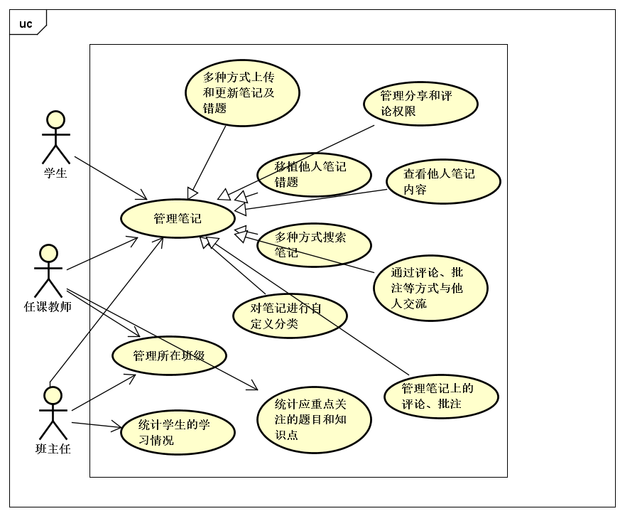

# 校园笔记系统 分析模型文档

By Trap x01

# 0. 更新历史

| 修改人员 | 日期         | 变更原因      | 版本号  |
| ---- | ---------- | --------- | ---- |
| 全体成员 | 2018/11/5  | 完成模板      | V0.0 |

# 1. 总体概念类图

# 2. 用例图

# 3. 详细用例说明

## 3.1 多种方式上传和更新笔记及错题

### 3.1.1 系统顺序图

### 3.1.2 状态图

### 3.1.3 活动图

### 3.1.4 业务流程

（把用例文档里的那一块抄过来）

| 正常流程 | 1. 用户选择上传和更新。 2. 系统进入上传和更新功能，系统列出当前用户的已上传笔记及错题列表。 3. 用户选择上传功能； &emsp;3.1 系统要求用户输入主题及详细信息（文本、图片、或音频） &emsp;3.2 用户输入这些信息。 &emsp;3.3 系统识别图片和音频信息至文本，等待用户确认或修改 &emsp;3.4 用户修改识别出的文本信息并确认上传并退回到主界面。 &emsp;3.5 系统保存原始信息和用户修改后的信息并回到上传和更新界面 4. 用户选中一个已上传的笔记或错题。 &emsp;4.1 系统显示此笔记或错题的详细信息（可选是原始信息或修改后的文本信息）。 &emsp;&emsp;4.1.1 用户选择修改原始信息 &emsp;&emsp;&emsp;4.1.1.1 流程见3.3-3.5 &emsp;&emsp;4.1.2 用户选择修改文本信息 &emsp;&emsp;&emsp;4.1.2.1 用户修改文本信息并上传  &emsp;4.2 系统保存这些信息，并退回到上传和更新界面。 |
| 扩展流程 | 3.1/4.1. 用户未填写主题 &emsp;3.1/4.1a 系统弹出提示，要求用户填写主题。 3.5. 用户未上传详细信息 &emsp;3.5a 系统弹出提示，要求用户填写详细信息。 |