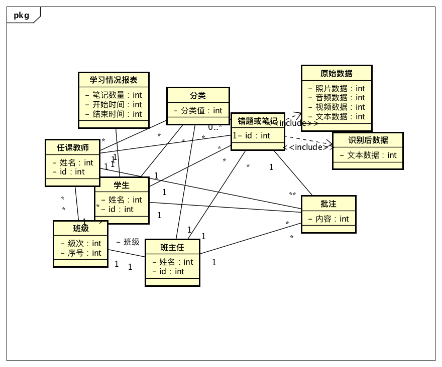
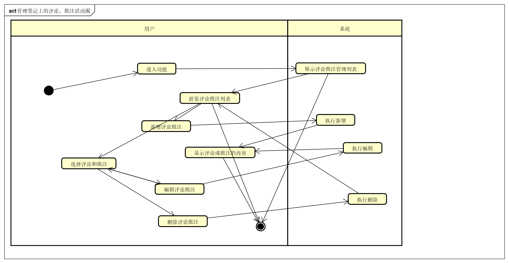
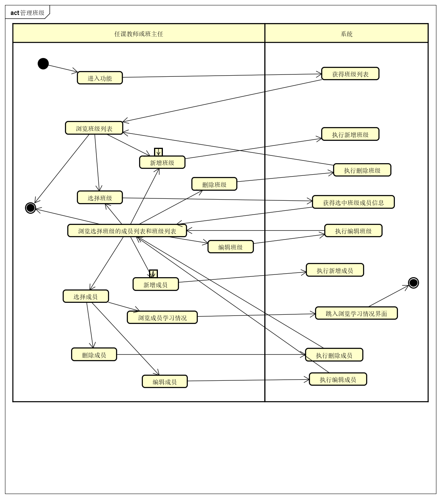
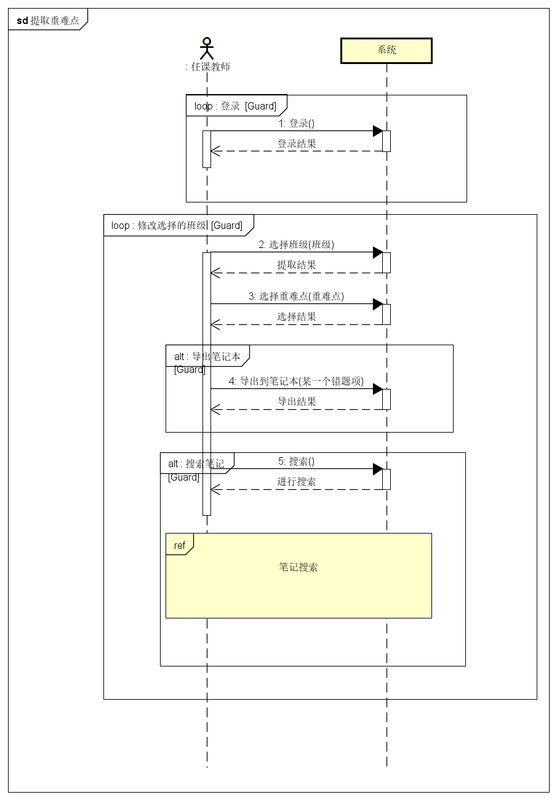
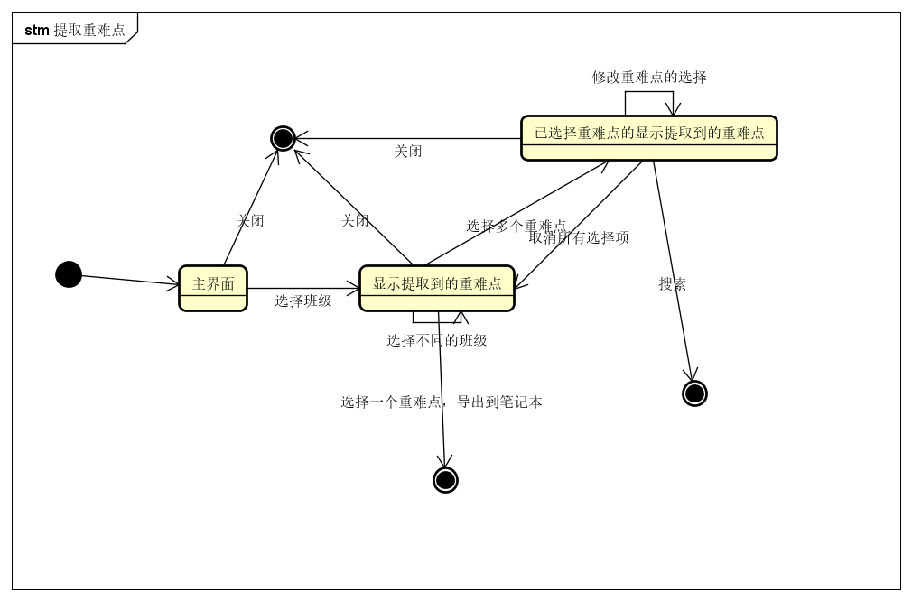

# 校园笔记系统 分析模型文档

By Trap x01

<!-- TOC -->

- [校园笔记系统 分析模型文档](#校园笔记系统-分析模型文档)
- [0. 更新历史](#0-更新历史)
- [1. 总体概念类图](#1-总体概念类图)
- [2. 用例图](#2-用例图)
- [3. 详细用例说明](#3-详细用例说明)
  - [3.1 多种方式上传和更新笔记及错题](#31-多种方式上传和更新笔记及错题)
    - [3.1.1 系统顺序图](#311-系统顺序图)
    - [3.1.2 状态图](#312-状态图)
    - [3.1.3 活动图](#313-活动图)
    - [3.1.4 业务流程](#314-业务流程)
  - [3.2 移植他人笔记错题](#32-移植他人笔记错题)
    - [3.2.1 系统顺序图](#321-系统顺序图)
    - [3.2.2 状态图](#322-状态图)
    - [3.2.3 活动图](#323-活动图)
    - [3.2.4 业务流程](#324-业务流程)
  - [3.3 对笔记进行自定义分类](#33-对笔记进行自定义分类)
    - [3.3.1 系统顺序图](#331-系统顺序图)
    - [3.3.2 状态图](#332-状态图)
    - [3.3.3 活动图](#333-活动图)
    - [3.3.4 业务流程](#334-业务流程)
  - [3.4 多种方式搜索笔记](#34-多种方式搜索笔记)
    - [3.4.1 系统顺序图](#341-系统顺序图)
    - [3.4.2 状态图](#342-状态图)
    - [3.4.3 活动图](#343-活动图)
    - [3.4.4 业务流程](#344-业务流程)
  - [3.5 查看他人笔记内容](#35-查看他人笔记内容)
    - [3.5.1 系统顺序图](#351-系统顺序图)
    - [3.5.2 状态图](#352-状态图)
    - [3.5.3 活动图](#353-活动图)
    - [3.5.4 业务流程](#354-业务流程)
  - [3.6 通过评论、批注等方式与他人交流](#36-通过评论批注等方式与他人交流)
    - [3.6.1 系统顺序图](#361-系统顺序图)
    - [3.6.2 状态图](#362-状态图)
    - [3.6.3 活动图](#363-活动图)
    - [3.6.4 业务流程](#364-业务流程)
  - [3.7 管理笔记上的评论、批注](#37-管理笔记上的评论批注)
    - [3.7.1 系统顺序图](#371-系统顺序图)
    - [3.7.2 状态图](#372-状态图)
    - [3.7.3 活动图](#373-活动图)
    - [3.7.4 业务流程](#374-业务流程)
  - [3.8 管理分享和评论权限](#38-管理分享和评论权限)
    - [3.8.1 系统顺序图](#381-系统顺序图)
    - [3.8.2 状态图](#382-状态图)
    - [3.8.3 活动图](#383-活动图)
    - [3.8.4 业务流程](#384-业务流程)
  - [3.9 管理所在班级](#39-管理所在班级)
    - [3.9.1 系统顺序图](#391-系统顺序图)
    - [3.9.2 状态图](#392-状态图)
    - [3.9.3 活动图](#393-活动图)
    - [3.9.4 业务流程](#394-业务流程)
  - [3.10 统计应重点关注的题目和知识点](#310-统计应重点关注的题目和知识点)
    - [3.10.1 系统顺序图](#3101-系统顺序图)
    - [3.10.2 状态图](#3102-状态图)
    - [3.10.3 活动图](#3103-活动图)
    - [3.10.4 业务流程](#3104-业务流程)
  - [3.11 统计学生的学习情况](#311-统计学生的学习情况)
    - [3.11.1 系统顺序图](#3111-系统顺序图)
    - [3.11.2 状态图](#3112-状态图)
    - [3.11.3 活动图](#3113-活动图)
    - [3.11.4 业务流程](#3114-业务流程)

<!-- /TOC -->

# 0. 更新历史

| 修改人员 | 日期         | 变更原因      | 版本号  |
| ---- | ---------- | --------- | ---- |
| 全体成员 | 2018/11/5  | 完成模板      | V0.0 |
| 陈俊达 | 2018/11/12 | 整合 | V1.0 |

# 1. 总体概念类图

# 2. 用例图

# 3. 详细用例说明

## 3.1 多种方式上传和更新笔记及错题

### 3.1.1 系统顺序图

### 3.1.2 状态图

### 3.1.3 活动图

### 3.1.4 业务流程

| 流程名 | 流程 |
| -- | -- |
| 正常流程 | 1. 用户选择上传和更新。 2. 系统进入上传和更新功能，系统列出当前用户的已上传笔记及错题列表。 3. 用户选择上传功能； &emsp;3.1 系统要求用户输入主题及详细信息（文本、图片、或音频） &emsp;3.2 用户输入这些信息。 &emsp;3.3 系统识别图片和音频信息至文本，等待用户确认或修改 &emsp;3.4 用户修改识别出的文本信息并确认上传并退回到主界面。 &emsp;3.5 系统保存原始信息和用户修改后的信息并回到上传和更新界面 4. 用户选中一个已上传的笔记或错题。 &emsp;4.1 系统显示此笔记或错题的详细信息（可选是原始信息或修改后的文本信息）。 &emsp;&emsp;4.1.1 用户选择修改原始信息 &emsp;&emsp;&emsp;4.1.1.1 流程见3.3-3.5 &emsp;&emsp;4.1.2 用户选择修改文本信息 &emsp;&emsp;&emsp;4.1.2.1 用户修改文本信息并上传  &emsp;4.2 系统保存这些信息，并退回到上传和更新界面。 |
| 扩展流程 | 3.1/4.1. 用户未填写主题 &emsp;3.1/4.1a 系统弹出提示，要求用户填写主题。 3.5. 用户未上传详细信息 &emsp;3.5a 系统弹出提示，要求用户填写详细信息。 |

## 3.2 移植他人笔记错题

### 3.2.1 系统顺序图

### 3.2.2 状态图

### 3.2.3 活动图

### 3.2.4 业务流程

| 流程名 | 流程 |
| -- | -- |
| 正常流程 | 1. 用户点击进入他人的主页。 2. 系统显示他人的错题及笔记列表。 3. 用户点击一条笔记。 4. 系统显示该条笔记的详细信息。 5. 用户点击fork功能。 6. 系统将该错题信息保存至登录用户的错题记录中，并返回至用户的错题记录列表。 |
| 扩展流程 | 5.该条错题无复制权限 &emsp;5a.系统提示无法复制，权限不足。 |

## 3.3 对笔记进行自定义分类

### 3.3.1 系统顺序图

### 3.3.2 状态图

### 3.3.3 活动图

### 3.3.4 业务流程

| 流程名 | 流程 |
| -- | -- |
| 正常流程 | 1. 用户新上传一次笔记/错题 &emsp;1.1 系统要求用户选择或新建适用于该笔记的标签 &emsp;1.2 用户选择已存在的标签，系统保存，并返回主界面 2. 用户选择分类管理功能，系统列出当前所有分类 3. 用户选择新增分类功能 &emsp;3.1 系统要求用户填写类别名称和类别描述 &emsp;3.2 用户输入这些信息 &emsp;3.3 系统保存这些信息，并返回分类管理界面 4. 用户选中一个分类，并选择编辑分类信息功能 &emsp;4.1 系统显示选中类别的名称和描述 &emsp;4.2 用户修改这些信息 &emsp;4.3 系统保存这些信息，返回到分类管理界面 5. 用户选中一个分类，并选择编辑笔记成员功能 &emsp;5.1 用户增加一篇笔记 &emsp;&emsp;5.1.1 系统显示本类别外的所有笔记 &emsp;&emsp;5.1.2 用户选择一篇或多篇笔记并确认增加 &emsp;&emsp;5.1.3 系统保存新笔记分类信息，并返回编辑笔记成员功能界面 &emsp;5.2 用户将笔记从原分类中移除 &emsp;&emsp;5.2.1 系统显示本类别内的所有笔记 &emsp;&emsp;5.2.2 用户选择一篇或多篇笔记并确认移除 &emsp;&emsp;5.2.3 系统保存新笔记分类信息，并返回编辑笔记成员功能界面 6. 用户选中一个分类，并选择查看笔记功能 &emsp;6.1 系统显示本类别内所有笔记 &emsp;6.2 用户选择一篇笔记 &emsp;6.3 系统显示笔记内容 7. 用户选择删除分类功能 &emsp;7.1 系统显示当前所有分类 &emsp;7.2 用户选择一个或多个分类并确认删除 &emsp;7.3 系统保存新笔记分类信息并返回分类管理界面  |
| 扩展流程 | 1.1a. 用户选择新建标签 &emsp;1.1a.1 系统跳转至流程3  3.3/4.3a. 用户未填写类别名称及描述 &emsp;3.3/4.3a.1 系统弹出提示，要求用户填写相关信息 5.1.3a 用户选择取消新增笔记到分类 &emsp;5.1.3a.1 系统取消新增笔记，返回上一个界面 5.2.3a 用户选择取消从分类中移除笔记 &emsp;5.2.3a.1 系统取消移除笔记，返回上一个界面 7.3a 用户选择删除分类 &emsp;7.3a.1 系统取消删除分类，返回上一个界面  |

## 3.4 多种方式搜索笔记

### 3.4.1 系统顺序图

### 3.4.2 状态图

### 3.4.3 活动图

### 3.4.4 业务流程

| 流程名 | 流程 |
| -- | -- |
| 正常流程 | 1. 用户在搜索框中输入文本 &emsp;1.1 系统显示搜索到的相关笔记，由相关度从高到低依次排列 &emsp;1.2 用户选择一条笔记 &emsp;1.3 系统显示笔记内容详情 2. 用户点击搜索图片功能 &emsp;2.1 系统识别图片并搜索 &emsp;2.2 系统显示搜索到的相关笔记，由相关度从高到低依次排列 &emsp;2.3 用户选择一条笔记 &emsp;2.4 系统显示笔记内容详情 3. 用户点击语音搜索功能 &emsp;3.1 系统识别语音内容并搜索 &emsp;3.2 系统显示搜索到的相关笔记，由相关度从高到低依次排列 &emsp;3.3 用户选择一条笔记 &emsp;3.4 系统显示笔记内容详情 4. 用户点击标签搜索功能 &emsp;4.1 系统显示所有分类标签 &emsp;4.2 用户点击一个或多个标签并确定选择 &emsp;4.3 系统显示搜索到的相关笔记，由标签符合数量的多少依次排列 &emsp;4.4 用户选择一条笔记 &emsp;4.5 系统显示笔记内容详情  |
| 扩展流程 | 1a. 用户没有输入任何内容 &emsp;1a.1 系统展示所有笔记  1.1/2.2/3.2/4.3a. 系统没有搜索到相关内容 &emsp;1.1/2.2/3.2/4.3a.1 系统弹出提示，说明没有搜索到有关信息  |

## 3.5 查看他人笔记内容

### 3.5.1 系统顺序图

### 3.5.2 状态图

### 3.5.3 活动图

### 3.5.4 业务流程

| 流程名 | 流程 |
| -- | -- |
| 正常流程 | 1. 用户搜索需要查看名称或id。 2. 系统显示符合条件的用户 3. 用户点击需要查看笔记内容的用户头像，系统列出当前用户的所有笔记概要信息。 4. 用户点击需要查看的笔记项； &emsp;4.1 若用户经过该被查看用户的允许 &emsp;&emsp;4.1.1 系统显示该笔记内容。 &emsp;4.2 若用户未经过该被查看用户的允许 &emsp;&emsp;4.2.1 系统提示请申请查看权限 |
| 扩展流程 | 4.2a 若用户被被查看用户设置为黑名单 &emsp;4.2a.1 系统提示你已被拉黑  |

## 3.6 通过评论、批注等方式与他人交流

### 3.6.1 系统顺序图

### 3.6.2 状态图

### 3.6.3 活动图

### 3.6.4 业务流程

| 流程名 | 流程 |
| -- | -- |
| 正常流程 | 1. 用户在笔记查看页面点击交流。 2. 系统显示交流工具栏。 3. 用户选择批注工具。 4. 系统显示批注画笔； &emsp;4.1 用户使用批注画笔选择需要进行批注的内容 &emsp;4.2 系统对内容进行标记后显示批注内容框。 &emsp;4.3 用户输入批注内容。 &emsp;4.4 系统显示输入后的批注内容 5. 用户选择评论。 6.系统显示评论列表； &emsp;6.1 用户输入评论内容并点击评论。 &emsp;6.2 系统显示评论后的评论列表。 |
| 扩展流程 |  |

## 3.7 管理笔记上的评论、批注

### 3.7.1 系统顺序图

### 3.7.2 状态图

### 3.7.3 活动图

### 3.7.4 业务流程

| 流程名 | 流程 |
| -- | -- |
| 正常流程 | 1. 用户选择批注评论管理功能。 2. 系统进入批注评论管理功能，系统列出当前所有批注评论信息。 3. 用户选择新增批注评论功能； &emsp;3.1 系统要求用户输入新批注评论的内容 &emsp;3.2 用户输入内容。 &emsp;3.3 系统保存内容，并退回到主界面。 4. 用户选中一个批注或评论，并选择编辑批注评论功能。 &emsp;4.1 系统显示选中批注或评论内容。 &emsp;4.2 用户修改这些信息。 &emsp;4.3 系统保存这些信息，并退回到主界面。 5. 用户选中一个批注或评论，并选择删除批注或评论功能 &emsp;5.1 系统要求用户确认删除批注或评论 &emsp;5.2 用户确认删除批注或评论 &emsp;5.3 系统删除批注或评论，并回到主界面。 |
| 扩展流程 | 5.2.2 用户选择取消删除 &emsp;5.2.2 系统取消删除，返回上一个界面。 |

## 3.8 管理分享和评论权限 

### 3.8.1 系统顺序图

### 3.8.2 状态图

### 3.8.3 活动图

### 3.8.4 业务流程

| 流程名 | 流程 |
| -- | -- |
| 正常流程 | 1. 用户选择管理申请权限功能。 2. 系统进入申请权限管理界面，系统列出当前所有申请信息。 3. 用户选择需要处理的申请信息； &emsp;3.1 系统显示申请的内容和申请用户 &emsp;3.2 用户选择通过申请。 &emsp;3.3 系统给予申请者权限，并退回到主界面。 &emsp;3.4 用户选择拒绝申请。 &emsp;3.5 系统拒绝申请，并退回到主界面。 4. 用户选中一个申请消息拉黑。 &emsp;4.1 系统将屏蔽此人对该用户的所有的申请消息。 |
| 扩展流程 |  |

## 3.9 管理所在班级

### 3.9.1 系统顺序图

管理班级相关

管理班级学生相关

### 3.9.2 状态图

### 3.9.3 活动图

### 3.9.4 业务流程

| 流程名 | 流程 |
| -- | -- |
| 正常流程 | 1. 用户选择班级管理功能。 2. 系统进入班级管理功能，系统列出当前教师加入的所有班级信息。 3. 用户选择新增班级功能； &emsp;3.1 系统要求用户输入新班级的名称，标签、其他教师信息和学生信息 &emsp;3.2 用户输入这些信息。 &emsp;3.3 系统保存这些信息，并退回到主界面。 4. 用户选中一个班级，并选择编辑班级信息功能。 &emsp;4.1 系统显示选中班级的名称，标签。 &emsp;4.2 用户修改这些信息。 &emsp;4.3 系统保存这些信息，并退回到主界面。 5. 用户选中一个班级，并选择编辑编辑成员信息功能。 &emsp;5.1 系统显示当前用户的班级已有的成员信息，包括姓名，角色（任课教师、学生）。 &emsp;5.2 用户增加一个成员 &emsp;&emsp;5.2.1 系统要求用户选择成员和其在班级内的角色 &emsp;&emsp;5.2.2 用户输入这些信息 &emsp;&emsp;5.2.3 系统保存新用户，并回到编辑成员信息界面 &emsp;5.3 用户选择一个成员，选择修改信息功能 &emsp;&emsp;5.3.1 系统显示被选中成员的角色 &emsp;&emsp;5.3.2 用户修改角色 &emsp;&emsp;5.3.3 系统保存信息，并回到编辑成员信息界面 &emsp;5.4 用户选择一个成员，选择删除班级功能 &emsp;&emsp;5.4.1 系统要求用户确认删除成员 &emsp;&emsp;5.4.2 用户确认删除 &emsp;&emsp;5.4.3 系统删除成员，并回到编辑成员信息界面 6. 用户选中一个班级，并选择删除班级功能 &emsp;6.1 系统要求用户确认删除班级 &emsp;6.2 用户确认删除班级 &emsp;6.3 系统删除班级，并回到主界面。|
| 扩展流程 | 3.3/4.3a. 用户未填写新班级的名称 &emsp;3.3/4.3a.1 系统弹出提示，要求用户填写名称。 5.4.2/6.2a. 用户选择取消删除 &emsp;5.4.2/6.2a.1 系统取消删除，返回上一个界面。 5.2.1a. 用户要求搜索用户 &emsp; 5.2.1a.1 系统允许用户输入搜索信息搜索学生，用户选择后自动输入 |
| 特殊需求 | 无 |

## 3.10 统计应重点关注的题目和知识点

### 3.10.1 系统顺序图

### 3.10.2 状态图

### 3.10.3 活动图

### 3.10.4 业务流程

| 流程名 | 流程 |
| -- | -- |
| 正常流程 | 1. 用户选择提取重点关注提示和知识点的功能。 2. 系统要求用户选择统计班级和统计时间段，支持多选班级，提供选择整个学期或者整个网站的快捷方式。。 3. 用户选择统计班级和时间段。 4. 系统根据输入的班级和时间段，统计在此时间段内出现次数最多的错题和笔记关键词或者图片。 |
| 扩展流程 | 4a. 用户重新输入班级和时间段 &emsp;4a.1 系统根据新的条件重新统计。 4b. 用户要求将某个笔记或者错题关键词导入笔记 &emsp;4b.1 系统要求选择目标笔记本，选择后，系统将关键词和/或图片导出到目标笔记本。 4c. 用户选择多个错题项，点击搜索 &emsp;4c.1 系统将选择的错题项（关键词和图片）作为搜索条件跳入搜索界面进行搜索。|

## 3.11 统计学生的学习情况

### 3.11.1 系统顺序图

### 3.11.2 状态图

### 3.11.3 活动图

### 3.11.4 业务流程

| 流程名 | 流程 |
| -- | -- |
| 正常流程 | 1. 用户选择统计学生学习情况的功能。 2. 系统要求用户选择学生和时间段。 3. 用户选择学生和时间段 4. 系统统计此时间段内学生在笔记方面的统计信息（笔记记录数，不同时间的频率），给出可视化数据。 |
| 扩展流程 | 3a. 用户搜索学生 &emsp;3a.1 系统允许用户输入搜索信息搜索学生，用户选择后自动输入。 3b. 用户要求导出报表。 &emsp;3b.1 系统导出报表 | 