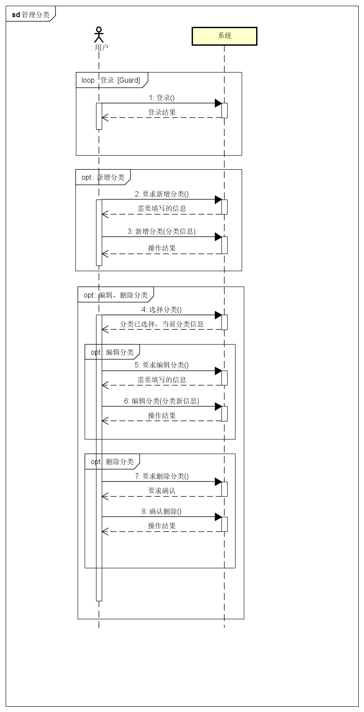
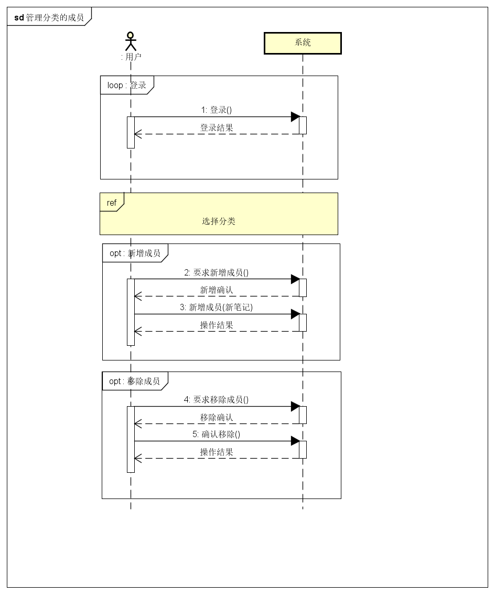
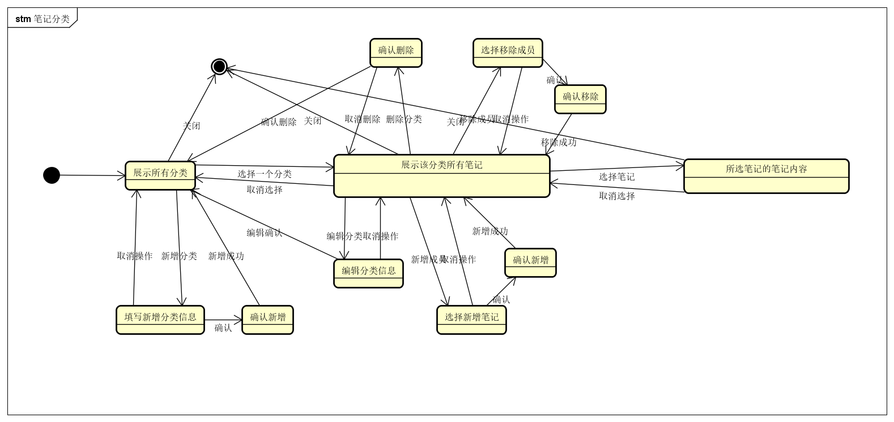
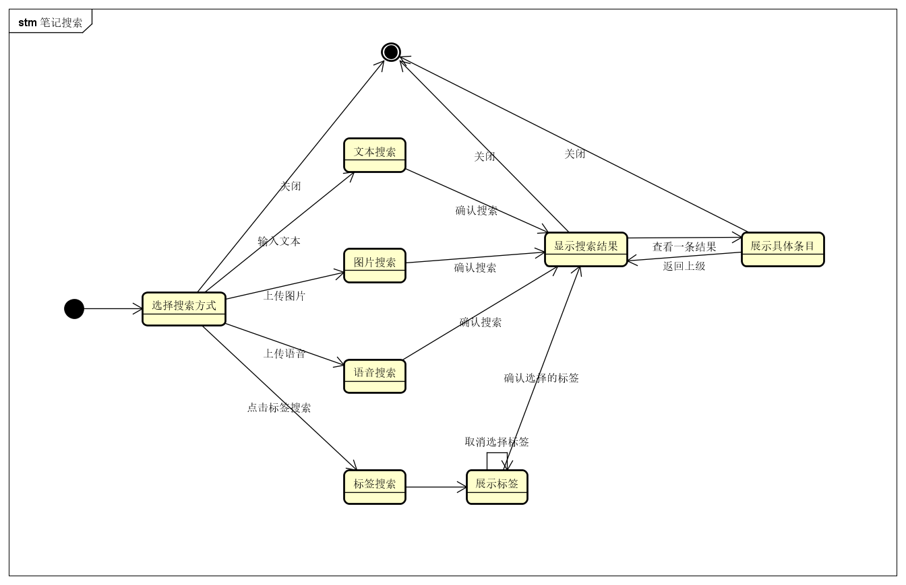
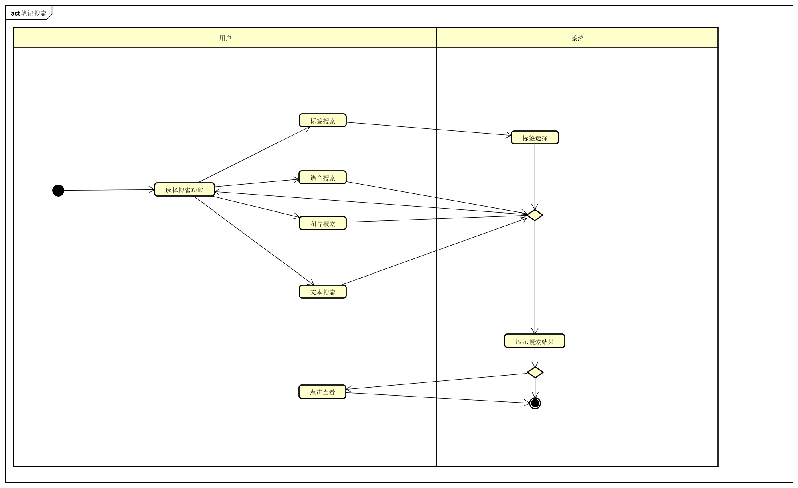

# 校园笔记系统 分析模型文档

By Trap x01

# 0. 更新历史

| 修改人员 | 日期         | 变更原因      | 版本号  |
| ---- | ---------- | --------- | ---- |
| 全体成员 | 2018/11/5  | 完成模板      | V0.0 |

# 1. 总体概念类图

# 2. 用例图

# 3. 详细用例说明

## 3.1 对笔记进行自定义分类

### 3.1.1 系统顺序图

### 3.1.2 状态图

### 3.1.3 活动图

### 3.1.4 业务流程

| 项目 | 值 |
| --- | --- |
| 正常流程 | 1. 用户新上传一次笔记/错题 &emsp;1.1 系统要求用户选择或新建适用于该笔记的标签 &emsp;1.2 用户选择已存在的标签，系统保存，并返回主界面 2. 用户选择分类管理功能，系统列出当前所有分类 3. 用户选择新增分类功能 &emsp;3.1 系统要求用户填写类别名称和类别描述 &emsp;3.2 用户输入这些信息 &emsp;3.3 系统保存这些信息，并返回分类管理界面 4. 用户选中一个分类，并选择编辑分类信息功能 &emsp;4.1 系统显示选中类别的名称和描述 &emsp;4.2 用户修改这些信息 &emsp;4.3 系统保存这些信息，返回到分类管理界面 5. 用户选中一个分类，并选择编辑笔记成员功能 &emsp;5.1 用户增加一篇笔记 &emsp;&emsp;5.1.1 系统显示本类别外的所有笔记 &emsp;&emsp;5.1.2 用户选择一篇或多篇笔记并确认增加 &emsp;&emsp;5.1.3 系统保存新笔记分类信息，并返回编辑笔记成员功能界面 &emsp;5.2 用户将笔记从原分类中移除 &emsp;&emsp;5.2.1 系统显示本类别内的所有笔记 &emsp;&emsp;5.2.2 用户选择一篇或多篇笔记并确认移除 &emsp;&emsp;5.2.3 系统保存新笔记分类信息，并返回编辑笔记成员功能界面 6. 用户选中一个分类，并选择查看笔记功能 &emsp;6.1 系统显示本类别内所有笔记 &emsp;6.2 用户选择一篇笔记 &emsp;6.3 系统显示笔记内容 7. 用户选择删除分类功能 &emsp;7.1 系统显示当前所有分类 &emsp;7.2 用户选择一个或多个分类并确认删除 &emsp;7.3 系统保存新笔记分类信息并返回分类管理界面  |
| 扩展流程 | 1.1a. 用户选择新建标签 &emsp;1.1a.1 系统跳转至流程3  3.3/4.3a. 用户未填写类别名称及描述 &emsp;3.3/4.3a.1 系统弹出提示，要求用户填写相关信息 5.1.3a 用户选择取消新增笔记到分类 &emsp;5.1.3a.1 系统取消新增笔记，返回上一个界面 5.2.3a 用户选择取消从分类中移除笔记 &emsp;5.2.3a.1 系统取消移除笔记，返回上一个界面 7.3a 用户选择删除分类 &emsp;7.3a.1 系统取消删除分类，返回上一个界面  |

## 3.2 多种方式搜索笔记

### 3.2.1 系统顺序图

### 3.2.2 状态图

### 3.2.3 活动图

### 3.2.4 业务流程

| 项目 | 值 |
| --- | --- |
| 正常流程 | 1. 用户在搜索框中输入文本 &emsp;1.1 系统显示搜索到的相关笔记，由相关度从高到低依次排列 &emsp;1.2 用户选择一条笔记 &emsp;1.3 系统显示笔记内容详情 2. 用户点击搜索图片功能 &emsp;2.1 系统识别图片并搜索 &emsp;2.2 系统显示搜索到的相关笔记，由相关度从高到低依次排列 &emsp;2.3 用户选择一条笔记 &emsp;2.4 系统显示笔记内容详情 3. 用户点击语音搜索功能 &emsp;3.1 系统识别语音内容并搜索 &emsp;3.2 系统显示搜索到的相关笔记，由相关度从高到低依次排列 &emsp;3.3 用户选择一条笔记 &emsp;3.4 系统显示笔记内容详情 4. 用户点击标签搜索功能 &emsp;4.1 系统显示所有分类标签 &emsp;4.2 用户点击一个或多个标签并确定选择 &emsp;4.3 系统显示搜索到的相关笔记，由标签符合数量的多少依次排列 &emsp;4.4 用户选择一条笔记 &emsp;4.5 系统显示笔记内容详情  |
| 扩展流程 | 1a. 用户没有输入任何内容 &emsp;1a.1 系统展示所有笔记  1.1/2.2/3.2/4.3a. 系统没有搜索到相关内容 &emsp;1.1/2.2/3.2/4.3a.1 系统弹出提示，说明没有搜索到有关信息  |