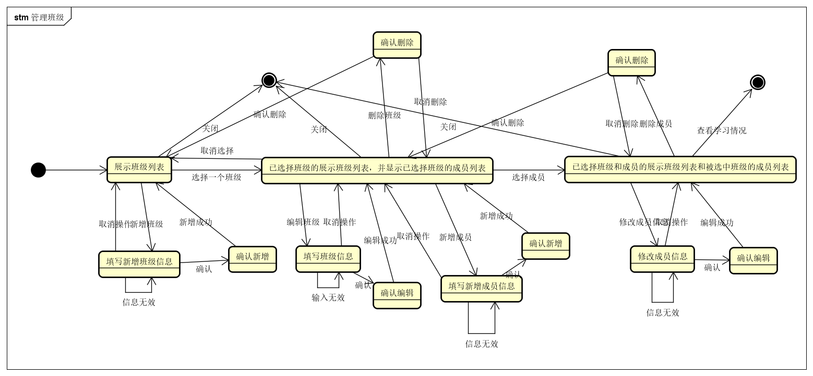
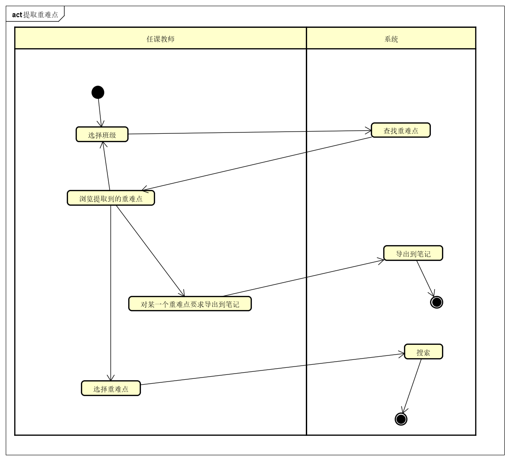

## 3.9 管理所在班级

### 3.9.1 系统顺序图

管理班级相关

管理班级学生相关

### 3.9.2 状态图

### 3.9.3 活动图

### 3.9.4 业务流程

| 流程名 | 流程 |
| -- | -- |
| 正常流程 | 1. 用户选择班级管理功能。 2. 系统进入班级管理功能，系统列出当前教师加入的所有班级信息。 3. 用户选择新增班级功能； &emsp;3.1 系统要求用户输入新班级的名称，标签、其他教师信息和学生信息 &emsp;3.2 用户输入这些信息。 &emsp;3.3 系统保存这些信息，并退回到主界面。 4. 用户选中一个班级，并选择编辑班级信息功能。 &emsp;4.1 系统显示选中班级的名称，标签。 &emsp;4.2 用户修改这些信息。 &emsp;4.3 系统保存这些信息，并退回到主界面。 5. 用户选中一个班级，并选择编辑编辑成员信息功能。 &emsp;5.1 系统显示当前用户的班级已有的成员信息，包括姓名，角色（任课教师、学生）。 &emsp;5.2 用户增加一个成员 &emsp;&emsp;5.2.1 系统要求用户选择成员和其在班级内的角色 &emsp;&emsp;5.2.2 用户输入这些信息 &emsp;&emsp;5.2.3 系统保存新用户，并回到编辑成员信息界面 &emsp;5.3 用户选择一个成员，选择修改信息功能 &emsp;&emsp;5.3.1 系统显示被选中成员的角色 &emsp;&emsp;5.3.2 用户修改角色 &emsp;&emsp;5.3.3 系统保存信息，并回到编辑成员信息界面 &emsp;5.4 用户选择一个成员，选择删除班级功能 &emsp;&emsp;5.4.1 系统要求用户确认删除成员 &emsp;&emsp;5.4.2 用户确认删除 &emsp;&emsp;5.4.3 系统删除成员，并回到编辑成员信息界面 6. 用户选中一个班级，并选择删除班级功能 &emsp;6.1 系统要求用户确认删除班级 &emsp;6.2 用户确认删除班级 &emsp;6.3 系统删除班级，并回到主界面。|
| 扩展流程 | 3.3/4.3a. 用户未填写新班级的名称 &emsp;3.3/4.3a.1 系统弹出提示，要求用户填写名称。 5.4.2/6.2a. 用户选择取消删除 &emsp;5.4.2/6.2a.1 系统取消删除，返回上一个界面。 5.2.1a. 用户要求搜索用户 &emsp; 5.2.1a.1 系统允许用户输入搜索信息搜索学生，用户选择后自动输入 |
| 特殊需求 | 无 |

## 3.10 统计应重点关注的题目和知识点

### 3.10.1 系统顺序图

### 3.10.2 状态图

### 3.10.3 活动图

### 3.10.4 业务流程

| 流程名 | 流程 |
| -- | -- |
| 正常流程 | 1. 用户选择提取重点关注提示和知识点的功能。 2. 系统要求用户选择统计班级和统计时间段，支持多选班级，提供选择整个学期或者整个网站的快捷方式。。 3. 用户选择统计班级和时间段。 4. 系统根据输入的班级和时间段，统计在此时间段内出现次数最多的错题和笔记关键词或者图片。 |
| 扩展流程 | 4a. 用户重新输入班级和时间段 &emsp;4a.1 系统根据新的条件重新统计。 4b. 用户要求将某个笔记或者错题关键词导入笔记 &emsp;4b.1 系统要求选择目标笔记本，选择后，系统将关键词和/或图片导出到目标笔记本。 4c. 用户选择多个错题项，点击搜索 &emsp;4c.1 系统将选择的错题项（关键词和图片）作为搜索条件跳入搜索界面进行搜索。|

## 3.11 统计学生的学习情况

### 3.11.1 系统顺序图

### 3.11.2 状态图

### 3.11.3 活动图

### 3.10.4 业务流程

| 流程名 | 流程 |
| -- | -- |
| 正常流程 | 1. 用户选择统计学生学习情况的功能。 2. 系统要求用户选择学生和时间段。 3. 用户选择学生和时间段 4. 系统统计此时间段内学生在笔记方面的统计信息（笔记记录数，不同时间的频率），给出可视化数据。 |
| 扩展流程 | 3a. 用户搜索学生 &emsp;3a.1 系统允许用户输入搜索信息搜索学生，用户选择后自动输入。 3b. 用户要求导出报表。 &emsp;3b.1 系统导出报表 | 