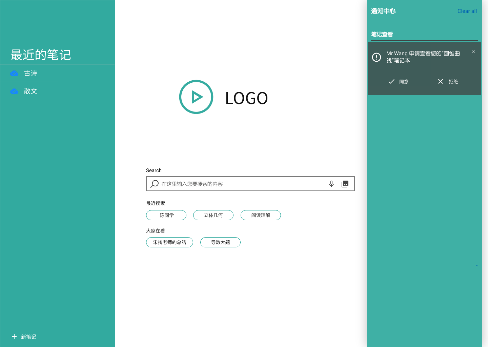
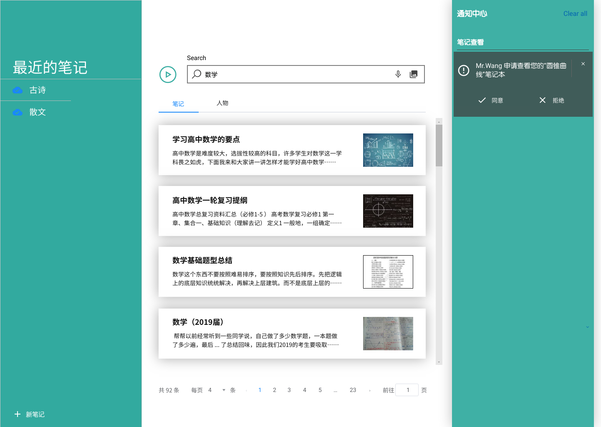
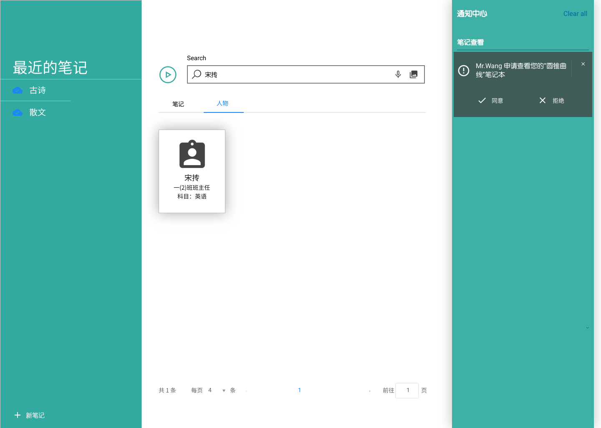
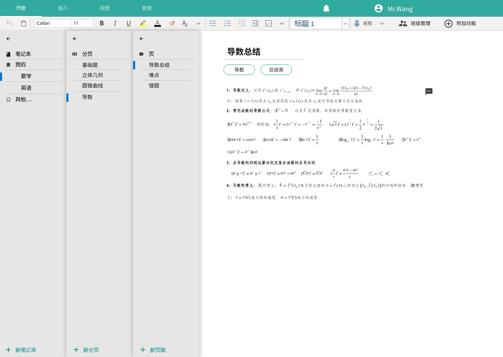
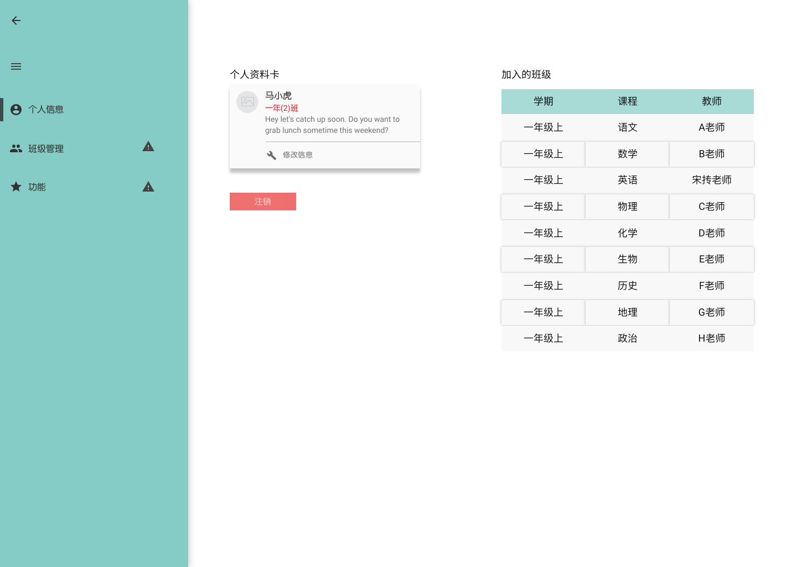
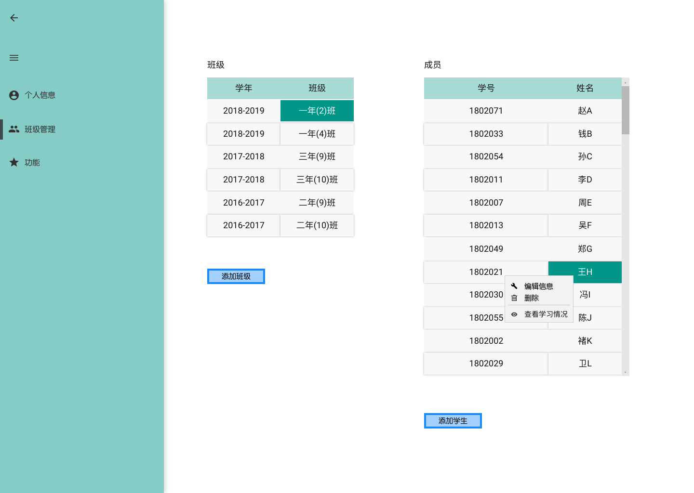
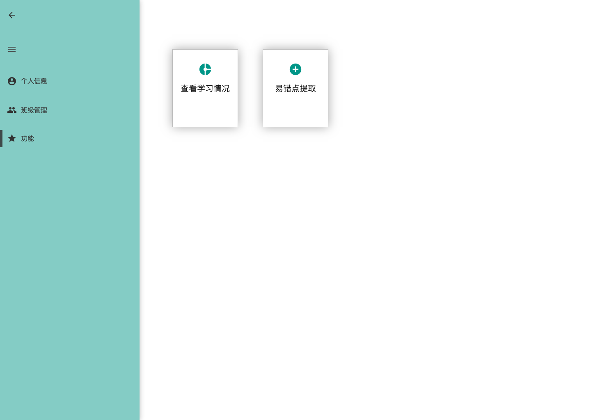
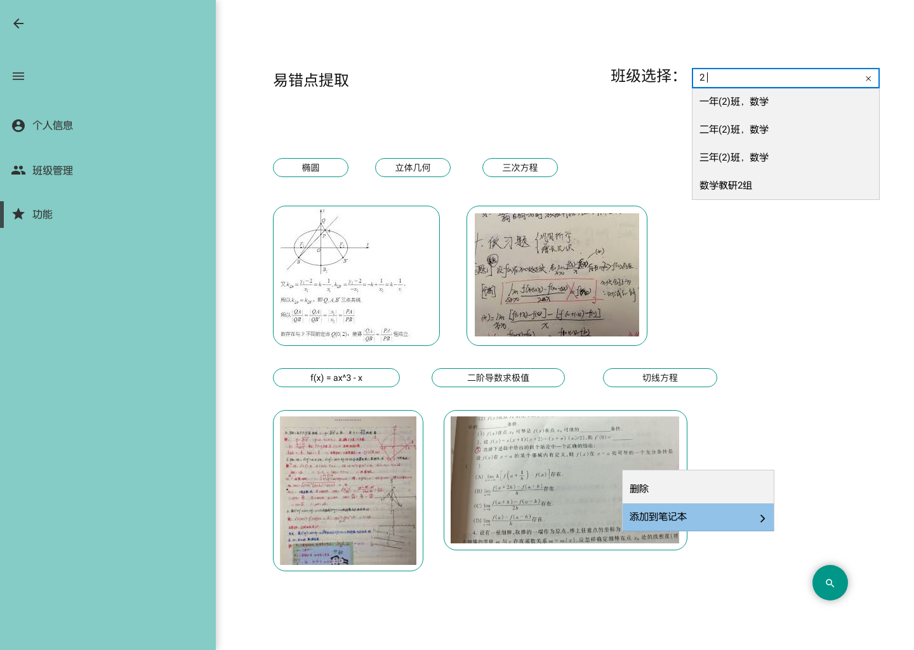
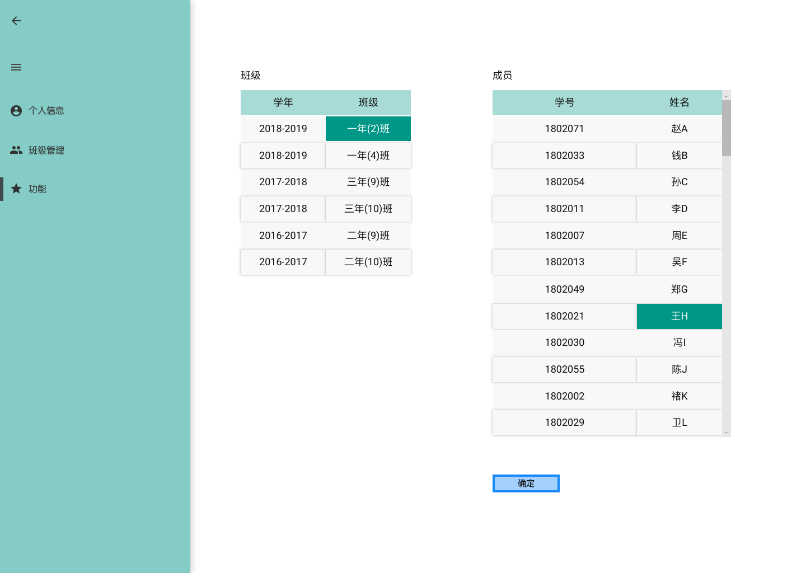
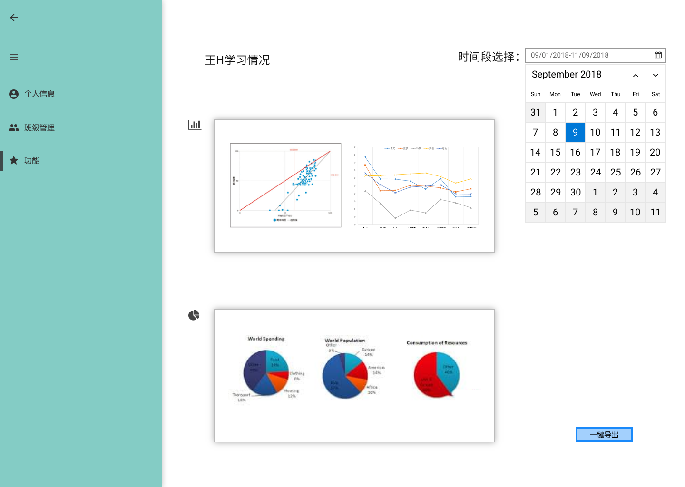

# 校园笔记系统 需求规格说明文档

By Trap x01

<!-- TOC -->

- [校园笔记系统 需求规格说明文档](#校园笔记系统-需求规格说明文档)
- [0. 更新历史](#0-更新历史)
- [1. 引言](#1-引言)
    - [1.1 引言](#11-引言)
    - [1.2 范围](#12-范围)
    - [1.3 定义、首字母缩写和缩略语](#13-定义首字母缩写和缩略语)
- [2. 总体描述](#2-总体描述)
    - [2.1 产品前景](#21-产品前景)
    - [2.2 业务需求](#22-业务需求)
    - [2.3 商品功能](#23-商品功能)
    - [2.4 用户特征](#24-用户特征)
    - [2.5 约束](#25-约束)
    - [2.6 假设](#26-假设)
- [3. 详细需求描述](#3-详细需求描述)
    - [3.1 对外接口需求](#31-对外接口需求)
    - [3.2 功能需求](#32-功能需求)
        - [3.2.1 笔记上传](#321-笔记上传)
            - [3.2.1.1 特性描述](#3211-特性描述)
            - [3.2.1.2 刺激/响应序列](#3212-刺激响应序列)
            - [3.2.1.3 相关功能需求](#3213-相关功能需求)
        - [3.2.2 移植他人笔记错题](#322-移植他人笔记错题)
            - [3.2.2.1 特性描述](#3221-特性描述)
            - [3.2.2.2 刺激/响应序列](#3222-刺激响应序列)
            - [3.2.2.3 相关功能需求](#3223-相关功能需求)
        - [3.2.3 笔记分类](#323-笔记分类)
            - [3.2.3.1 特性描述](#3231-特性描述)
            - [3.2.3.2 刺激/响应序列](#3232-刺激响应序列)
            - [3.2.9.3 相关功能需求](#3293-相关功能需求)
        - [3.2.4 多种方式搜索笔记](#324-多种方式搜索笔记)
            - [3.2.4.1 特性描述](#3241-特性描述)
            - [3.2.4.2 刺激/响应序列](#3242-刺激响应序列)
            - [3.2.10.3 相关功能需求](#32103-相关功能需求)
        - [3.2.5 查看他人笔记内容](#325-查看他人笔记内容)
            - [3.2.5.1 特性描述](#3251-特性描述)
            - [3.2.5.2 刺激/响应序列](#3252-刺激响应序列)
            - [3.2.5.3 相关功能需求](#3253-相关功能需求)
        - [3.2.6 通过评论、批注等方式与他人交流](#326-通过评论批注等方式与他人交流)
            - [3.2.6.1 特性描述](#3261-特性描述)
            - [3.2.6.2 刺激/响应序列](#3262-刺激响应序列)
            - [3.2.6.3 相关功能需求](#3263-相关功能需求)
        - [3.2.7 管理笔记上的评论、批注](#327-管理笔记上的评论批注)
            - [3.2.7.1 特性描述](#3271-特性描述)
            - [3.2.7.2 刺激/响应序列](#3272-刺激响应序列)
            - [3.2.7.3 相关功能需求](#3273-相关功能需求)
        - [3.2.8 管理分享和评论权限](#328-管理分享和评论权限)
            - [3.2.8.1 特性描述](#3281-特性描述)
            - [3.2.8.2 刺激/响应序列](#3282-刺激响应序列)
            - [3.2.8.3 相关功能需求](#3283-相关功能需求)
        - [3.2.9 管理所在班级](#329-管理所在班级)
            - [3.2.9.1 特性描述](#3291-特性描述)
            - [3.2.9.2 刺激/响应序列](#3292-刺激响应序列)
            - [3.2.9.3 相关功能需求](#3293-相关功能需求-1)
        - [3.2.10 统计应重点关注的题目和知识点](#3210-统计应重点关注的题目和知识点)
            - [3.2.10.1 特性描述](#32101-特性描述)
            - [3.2.10.2 刺激/响应序列](#32102-刺激响应序列)
            - [3.2.10.3 相关功能需求](#32103-相关功能需求-1)
        - [3.2.11 统计学生的学习情况](#3211-统计学生的学习情况)
            - [3.2.11.1 特性描述](#32111-特性描述)
            - [3.2.11.2 刺激/响应序列](#32112-刺激响应序列)
            - [3.2.11.3 相关功能需求](#32113-相关功能需求)
    - [3.3 性能需求](#33-性能需求)
    - [3.4 约束](#34-约束)
    - [3.5 质量属性](#35-质量属性)

<!-- /TOC -->

# 0. 更新历史

| 修改人员 | 日期         | 变更原因      | 版本号  |
| ---- | ---------- | --------- | ---- |
| 全体成员 | 2018/11/5  | 完成模板      | V0.0 |
| 陈俊达 | 2018/11/12 | 整合 | V1.0 |

# 1. 引言

## 1.1 引言

本文档描述了校园笔记系统的功能需求以及非功能需求。

## 1.2 范围

| 特性 | 版本1 | 版本2 | 版本3 |
| -- | -- | -- | -- |
| FE1 | 能够支持主要特性FE-1里提到的完整功能 | | |
| FE2 | 能够支持编辑已上传的错题和笔记 |  |  |
| FE3 | 允许用户查看自己笔记的历史版本 | 允许用户查看他人笔记的历史版本 | |
| FE4 | 支持自定义笔记分类功能 |  | 加入自动提取笔记关键词的功能 |
| FE5 | 不实现 | 系统允许查看他人笔记 | 加入自然语言查找、搜索和推荐笔记的功能 | 
| FE6 | 不实现 | 系统在他人笔记上评论和批注 | |
| FE7 | 不实现 | 系统允许用户设置分享和评论权限 | |
| FE8 | 不实现 | 实现班级管理 | 实现学生学习情况分析功能 |
| FE9 | 不实现 | 不实现 | 实现提取应重点关注的知识点的功能 |

LI-1: 本系统针对的是面向高考的普通初中、高中学校，面向目标为中考和高考的普通学生；
LI-2: 本系统限制于传统的班级制管理模式（即在一段时间中一个班级有固定的一个班主任，每个班级每个课程有固定的任课老师）
LI-3: 本系统默认所使用电子设备支持键盘和触摸，有的功能需要触控笔的支持
LI-4: 本系统默认服务器搭建于互联网，共享、分析等功能需要互联网接入支持

## 1.3 定义、首字母缩写和缩略语

# 2. 总体描述

## 2.1 产品前景

本系统通过直截了当、利用了现代科技的、具备各种功能的笔记系统能够帮助教学和学习过程的涉众（即学生、任课教师和班主任）提高学习和工作的效率。用户可以使用更少的时间、通过文本、图片、视频、语音等方式更完整全面的记录、编辑、查找笔记，并能够更方便地将笔记与其他用户共享，从而更加高效地利用笔记这个课堂学习中必不可少的资料。除此之外，还提供学习情况分析和重点知识点分析两大功能帮助班主任和任课教师更科学全面地制定教学和管理计划，更有效地提高成绩。同时，本系统通过真实的走访调查，由真实的用户需求得来，解决了真正的教学痛点，得到了各个受众的强烈支持。

## 2.2 业务需求

BR1: 使用该系统后，学生、任课教师和班主任花费在记录、更新笔记错题上的时间减少，记录和更新笔记的方式增加。

BR2: 使用该系统后，学生、任课教师和班主任话费在查找错题和笔记上的时间显著减少。

BR3: 使用该系统后，让学生能够在他人预先允许、且不影响他人的情况下自助地查看到他人的笔记；也能在他人允许的情况下，在笔记上通过评论、批注等方式与他人交流。

BR4: 任课教师可以通过自己所在班级的笔记情况，快速提取应重点关注的知识点。

BR5: 班主任可以通过可以通过自己所在班级的笔记情况，初步掌握学生的学习情况。

## 2.3 商品功能

FE1: 系统记录保存使用者通过图片（并支持在图片上编辑（裁剪、旋转、标注、水印）），文本，音频、录像等方式上传的笔记

FE2: 系统允许编辑已上传的错题和笔记

FE3: 系统允许用户查看自己和他人笔记的历史版本

FE4: 系统有自定义笔记分类功能，并能在一定程度上自动提取笔记的关键词

FE5: 系统允许查看他人笔记

FE6: 系统在他人笔记上评论和批注

FE7: 系统允许用户设置分享和评论权限

FE8: 系统应能为班主任提供班级管理功能，并能够进行学生学习情况分析。

FE9：系统应能为任课教师提取应重点关注的知识点。

## 2.4 用户特征

| 涉众 | 特征 | 主要目标 | 态度 | 主要关注点 | 约束条件 |
| --- | --- | --- | --- | --- | --- |
| 学生 | 普遍具有电子设备使用经验，乐于接受新事物 | 能够高效记录和利用错题和笔记，提高学习成绩 | 强烈支持 | 保证系统的低学习成本和使用方便性 | 无 |
| 任课教师 | 负责教授课程，对学生的错题管理及成绩提高起直接性的作用 | 能高效地对学生的学习做到全面了解，掌握应重点关注的知识点，提升学生成绩 | 非常支持系统开发 | 能否直接对学生的学习情况进行有效的了解，能够方便快捷地获得应重点关注的知识点，以及能否方便地上传、更新笔记 | 无       |
| 班主任 | 具有班级管理能力 | 从整体上了解学生错题记录情况和学生学习情况 | 强烈支持 | 保证系统的低学习成本和使用方便性以及显示学习情况的整体性 | 无 |

## 2.5 约束

C1. 需要有良好的人机交互界面，用户可以在PC、手机和平板等多个平台使用
C2. 系统在已架构好的服务器和主机上开发
C3. 使用机器学习技术

## 2.6 假设

AE1. 已有运行良好的服务器
AE2. 所有受众均可以使用本系统

# 3. 详细需求描述

## 3.1 对外接口需求

主页左侧为用户最近打开的笔记本，右侧为用户的通知中心，包含别人申请查看自己的笔记本的通知等。而中间为笔记的搜索，除了提供输出框，还可以通过语音和图片来查找笔记。笔记搜索的下方还有最近搜索笔记和大家在看的笔记。

在搜索界面输入文字或者使用语音转文字进行搜索之后，会分为笔记和人物两类显示搜索到的结果。

笔记结果会显示笔记的标题、笔记的部分文字和笔记的图片。

人物结果会显示用户的姓名等信息。

打开一个笔记本后，页面显示为笔记的编辑界面。左侧为选择笔记本、分区和分页的列表，右侧为笔记的内容。页面上方为文本编辑工具栏。

通过编辑页面的右上角的用户可以进入个人信息界面。在个人信息界面，左侧会显示用户可用的功能点，中间显示用户的个人信息，且用户可修改自己的信息；右侧显示用户自己加入的班级。

对于班主任和任课教师，用户可以在个人信息界面进入班级管理功能。

在这个功能点中，中间会显示用户所任教/管理的班级，右侧显示选中班级中的成员。下部可添加班级和添加学生。

对于班主任和任课教师，用户可以在个人信息界面进入更多功能界面，目前应该包含查看学习情况和易错点提取的功能。

任课教师课使用提取易错点的功能。具体使用方法请参考[3.2.10 统计应重点关注的题目和知识点](#3210-统计应重点关注的题目和知识点)。

班主任可使用查看学习情况功能。具体使用方法请参考[3.2.11 统计学生的学习情况](#3211-统计学生的学习情况)。

## 3.2 功能需求

### 3.2.1 笔记上传

#### 3.2.1.1 特性描述

学生、任课教师和班主任可以通过多种方式上传和更新笔记及错题。

优先级=4

#### 3.2.1.2 刺激/响应序列

刺激：用户选择**上传和更新**功能

响应：系统进入****已上传笔记及错题列表****页面，显示当前用户的已上传笔记及错题列表

刺激：处于****已上传笔记及错题列表****页面，用户点击**上传笔记或错题**功能

响应：系统进入****上传笔记及错题****页面，显示****主题****，****详细信息****的输入框

刺激：处于****上传笔记及错题****页面，用户输入信息后点击**确认**

响应：系统识别****详细信息****中的图片和音频信息，等待用户确认或修改

刺激：用户修改文本信息后，点击**确认**

响应：系统保存信息，返回****已上传笔记及错题列表****界面

刺激：处于****已上传笔记及错题列表****页面，用户点击一条错题

响应：系统进入****笔记或错题详细信息****页面，显示选择错题的详细信息

刺激：处于****笔记或错题详细信息****页面，用户点击****修改原始信息****

响应：系统进入****上传笔记及错题****页面，显示****主题****，****详细信息****的输入框

刺激：处于****上传笔记及错题****页面，用户输入信息后点击**确认**

响应：系统识别****详细信息****中的图片和音频信息，等待用户确认或修改

刺激：用户修改文本信息后，点击**确认**

响应：系统保存信息，返回****已上传笔记及错题列表****界面

刺激：处于****笔记或错题详细信息****页面，用户点击****修改文本信息****

响应：系统进入****文本信息修改****页面

刺激：处于****笔记或错题详细信息****页面，用户修改文本信息后点击****确认****

响应：系统保存信息，并返回****已上传笔记及错题列表**页面

#### 3.2.1.3 相关功能需求

| 编号                           | 需求描述与度量                                  |
| ---------------------------- | ---------------------------------------- |
| NoteManagement.Show        | 系统进入****已上传笔记及错题列表****页面，显示当前用户的已上传笔记及错题列表 |

| 编号                                       | 需求描述与度量                                  |
| ---------------------------------------- | ---------------------------------------- |
| NoteManagement.Modify                  | 用户点击一条错题信息，进入****笔记和错题详细信息****界面（****输出****、****输入****） |
| NoteManagement.Modify.Raw           | 用户点击****修改原始信息****（****查询****），见NoteManagement.Add |
| NoteManagement.Modify.Text    | 用户点击****修改文本信息****（****查询****），系统进入****修改文本信息****界面 |
| NoteManagement.Modify.Text.Success | 用户修改文本信息后，点击****提交****，若系统成功将错题存入，则弹出提示框（****输出****），提示存入成功，用户点击****确认****按钮（****查询****），则回到****已上传笔记及错题列表****界面（****输出****） |
| NoteManagement.Modify.Text.Failure | 用户修改文本信息后，点击****提交****，若系统将客户信息表存入草稿箱失败，则弹出提示框（****输出****），提示存入失败，用户点击****确认****按钮（****查询****），则回到****修改文本信息****界面（****输出****） |

| 编号                                       | 需求描述与度量                                  |
| ---------------------------------------- | ---------------------------------------- |
| NoteManagement.Add                     | 用户处于****已上传笔记及错题列表****界面，点击****上传笔记或错题****，系统进入****上传笔记或错题****界面（****查询****、****输出****） |
| NoteManagement.Add.Cancel              | 用户进入****上传笔记或错题****界面后，点击****取消****按钮（****查询****），系统返回****已上传笔记及错题列表****界面，点击（****输出****） |
| NoteManagement.Add.Validate            | 在用户填写相关信息的过程中，系统应实时检查数据格式并给出输入提示以及错误提示（****输出****）。 |
| NoteManagement.Add.WrongFormat         | 用户修改客户信息后点击保存，但是数据类型错误，系统弹出窗口提示“数据类型错误，提交失败，请正确输入”（****输出****） |
| NoteManagement.Add.Identification             | 用户填写完成错题信息后点击****提交****按钮（****查询****），系统进入****识别上传信息****流程（****输出****） |
| NoteManagement.Add.Identification     | 用户处于****修改上传文本信息****界面，修改后，点击****确认提交****按钮（****查询****） |
| NoteManagement.Add.Identification.Success | 系统成功保存错题信息（****逻辑文件****），则弹出提示框（****输出****），提示成功保存，用户点击****确认****按钮后回到****已上传笔记及错题列表****界面（****查询****） |

### 3.2.2 移植他人笔记错题

#### 3.2.2.1 特性描述

学生、任课教师和班主任移植他人的笔记错题。

优先级=5

#### 3.2.2.2 刺激/响应序列

刺激：用户点击他人的主页。

响应：系统进入他人的主页，并显示他人的错题及笔记列表。

刺激：用户点击一条笔记。

响应：系统显示该条笔记的详细信息。

刺激：用户点击fork功能。

响应：若无权限，系统提示无法复制，权限不足；若有权限，系统将该错题信息保存至登录用户的错题记录中，并返回至用户的错题记录列表。

#### 3.2.2.3 相关功能需求

| 编号                  | 需求描述与度量                     |
| ------------------- | --------------------------- |
| OtherNote.Show | 用户进入相关界面后，系统显示他人的基本信息及错题和笔记列表。 |
| OtherNote.Detail  | 用户点击一条笔记，系统显示该条笔记的详细信息。            |
| OtherNote.Detail.Fork | 用户点击fork。                 |
| OtherNote.Detail.Fork.Success | 用户有权限，系统将该错题信息保存至登录用户的错题记录中，并记录操作，并返回至用户的错题记录列表。                 |
| OtherNote.Detail.Fork.Failure  | 用户无权限，系统复制失败，系统弹出提示“用户无权限”。                 |

### 3.2.3 笔记分类

#### 3.2.3.1 特性描述

学生、任课教师和班主任可以添加自定义标签或使用系统提取的标签，对笔记进行自定义分类，便于查找

优先级=3

#### 3.2.3.2 刺激/响应序列

刺激：用户点击**新笔记**按钮进入页面后，输入或上传内容以新建笔记

响应：系统进入**分类选择**页面，显示目前所有笔记的分类

刺激：处于**分类选择**页面，用户点击一条分类信息

响应：系统进入**笔记编辑**页面，同时显示该笔记的所有所属分类信息

刺激：用户处于**分类选择**页面，用户点击**新建分类**按钮

响应：系统进入**笔记编辑**页面，系统弹出提示框，提示用户点击**增加新页**按钮

刺激：用户处于**增加新页**页面，用户填写类别名称和类别描述

响应：系统返回**笔记编辑**页面，同时显示该笔记的所有所属分类信息

刺激：用户处于**笔记编辑**页面，用户左键双击分类名称

响应：系统进入**编辑分类信息**页面，以可修改形式显示该分类信息

刺激：用户处于**编辑分类信息**页面，点击**取消**按钮或点击页面以外位置

响应：系统返回**笔记编辑**页面

刺激：用户处于**编辑分类信息**页面，点击**确定**按钮或按下回车键

响应：系统保存填写信息，返回**笔记编辑**页面

刺激：用户处于**笔记编辑**页面，右键单击一个分类，选择**编辑分类成员**选项

响应：系统进入**编辑分类成员**页面，以可拖动方式显示分类所有笔记

刺激：用户处于**编辑分类成员**页面，将一个笔记从本分类拖至其他分类

响应：系统将笔记从本分类中移除，添加至其他分类，返回**编辑分类成员**页面

刺激：用户处于**编辑分类成员**，将一个笔记从其他分类拖至本分类

响应：系统将笔记从其他分类中移除，添加至本分类，返回**编辑分类成员**页面

刺激：用户处于**笔记编辑**页面，点击一个分类

响应：系统显示该分类下所有笔记

刺激：用户处于**笔记编辑**页面，右键单击一个分类，选择**删除分类**选项

响应：系统进入**确认删除分类**页面

刺激：用户处于**确认删除分类**页面，点击**确认**按钮

响应：原分类下所有笔记归为**未分类**，系统返回**笔记编辑**页面

刺激：用户处于**确认删除分类**页面，点击**取消**按钮

响应：系统返回**笔记编辑**页面

#### 3.2.9.3 相关功能需求

| 编号 | 需求描述与度量 |
| --- | --- |
| CategoryManagement.Category | 系统显示当前用户所有的分类，并提供增加、删除和修改的功能 |
| CategoryManagement.Category.Select | 用户选择一个分类后，系统显示选中分类的笔记信息，具体情况见CategoryManagement.Member |
| CategoryManagement.Category.Add | 用户点击**新建分类**功能，系统显示要用户填入的信息（类别名称、类别描述） |
| CategoryManagement.Category.Add.Cancel | 用户点击取消，系统显示上一个界面 |
| CategoryManagement.Category.Add.Submit | 用户输入结束，进行提交 |
| CategoryManagement.Category.Add.Submit.Success | 系统提交信息并成功 |
| CategoryManagement.Category.Add.Submit.Failure | 系统提交信息失败，显示错误信息，返回填写信息界面 |
| CategoryManagement.Category.Modify | 用户点击**编辑分类信息**功能，系统显示当前分类的信息，并要求用户修改 |
| CategoryManagement.Category.Modify.Confirm | 系统提示用户是否修改 |
| CategoryManagement.Category.Modify.Confirm.Cancel | 用户点击取消，系统显示上一个界面 |
| CategoryManagement.Category.Modify.Submit | 用户输入结束，进行提交 |
| CategoryManagement.Category.Modify.Submit.Success | 系统提交信息并成功 |
| CategoryManagement.Category.Modify.Submit.Failure | 系统提交信息失败，显示错误信息，返回填写信息界面 |
| CategoryManagement.Category.Delete | 用户选择一个分类，点击**删除分类**功能， |
| CategoryManagement.Category.Delete.Confirm | 系统提示用户是否确认删除 |
| CategoryManagement.Category.Delete.Confirm.Cancel | 用户点击取消，返回上一个界面 |
| CategoryManagement.Category.Delete.Confirm.Success | 用户点击确认，系统删除分类并成功 |
| CategoryManagement.Category.Delete.Confirm.Failure | 用户确认删除，系统提交信息失败，显示错误信息，返回**笔记编辑**界面 |

| 编号 | 需求描述与度量 |
| --- | --- |
| CategoryManagement.Member | 用户选择分类后，系统显示选中分类下的笔记信息 |
| CategoryManagement.Member.Add | 用户点击**编辑分类成员**功能，将一个新笔记拖动至本分类 |
| CategoryManagement.Member.Add.Confirm | 系统提示用户是否增加该新笔记 |
| CategoryManagement.Member.Add.Confirm.Cancel | 用户不确认增加，系统返回**编辑分类成员**界面 |
| CategoryManagement.Member.Add.Submit | 用户确认增加，系统提交信息 |
| CategoryManagement.Member.Add.Submit.Success | 系统提交信息并成功 |
| CategoryManagement.Member.Add.Submit.Failure | 系统提交信息失败，显示错误信息，返回**编辑分类成员**界面 |
| CategoryManagement.Member.Remove | 用户点击**编辑分类成员**功能，将一个本分类的笔记移除 |
| CategoryManagement.Member.Remove.Confirm | 系统提示用户是否移除该笔记 |
| CategoryManagement.Member.Remove.Confirm.Cancel | 用户不确认移除，系统返回**编辑分类成员**界面 |
| CategoryManagement.Member.Remove.Submit | 用户确认移除，系统提交信息 |
| CategoryManagement.Member.Remove.Submit.Success | 系统提交信息并成功 |
| CategoryManagement.Member.Remove.Submit.Failure | 系统提交信息失败，显示错误信息，返回**编辑分类成员**界面 |

### 3.2.4 多种方式搜索笔记

#### 3.2.4.1 特性描述

学生、任课教师和班主任可以通过输入文字、上传图片和声音、选择标签等方式对笔记进行检索

优先级=2

#### 3.2.4.2 刺激/响应序列

刺激：用户点击搜索框的空白部分，并输入文本

响应：系统显示搜索到的相关笔记，由相关度从高到低依次排列

刺激：用户点击**图片搜索**功能，上传一张图片

响应：系统识别图片内容，显示搜索到的相关笔记，由相关度从高到低依次排列

刺激：用户点击**语音搜索**功能，上传一段语音

响应：系统识别语音内容，显示搜索到的相关笔记，由相关度从高到低依次排列

刺激：用户点击**标签搜索**功能

响应：系统分类展示所有标签

刺激：用户处于**标签选择**界面，选择一个或多个标签

响应：系统搜索标签相关笔记，由相关度从高到低依次排列

刺激：用户处于搜索结果界面，点击一条笔记

响应：系统进入**笔记编辑**界面，显示笔记内容详情

#### 3.2.10.3 相关功能需求

| 编号 | 需求描述与度量 |
| --- | --- |
| SearchManagement.TextSearch | 系统显示文字搜索界面 |
| SearchManagement.TextSearch.Upload | 系统将用户输入的文本上传 |
| SearchManagement.TextSearch.ShowResultsList | 系统搜索用户输入内容并展示相关所有笔记 |
| SearchManagement.ImageSearch | 系统显示图像搜索界面 |
| SearchManagement.ImageSearch.Upload | 系统将用户选择的照片上传 |
| SearchManagement.ImageSearch.Recognize | 系统识别用户上传的图片内容 |
| SearchManagement.ImageSearch.ShowResultsList | 系统搜索用户上传的图片内容并展示相关所有笔记 |
| SearchManagement.VoiceSearch | 系统显示语音搜索界面 |
| SearchManagement.VoiceSearch.Upload | 系统将用户选择的语音上传 |
| SearchManagement.VoiceSearch.Recognize | 系统识别用户上传的语音内容 |
| SearchManagement.VoiceSearch.ShowResultsList | 系统搜索用户上传的语音内容并展示相关所有笔记 |
| SearchManagement.TagSearch | 系统显示标签搜索界面 |
| SearchManagement.TagSearch.MultiSelect | 用户可选择多个标签 |
| SearchManagement.TagSearch.Deselect | 用户可取消选择某个标签 |
| SearchManagement.TagSearch.ShowResultsList | 系统搜索用户选择的标签并展示相关所有笔记 |
| SearchManagement.ShowNote | 用户点击某条笔记，系统展示笔记详情，进入**笔记编辑**界面 |

### 3.2.5 查看他人笔记内容 

#### 3.2.5.1 特性描述

用户可以在登录后，查看他人笔记内容。

优先级=3

#### 3.2.5.2 刺激/响应序列

刺激：用户点击**搜索**按钮进入页面后，输入筛选信息以查询需要查看内容的用户

响应：系统进入**搜索**页面，显示符合筛选条件的简略用户信息（姓名、班级/科目、主页内容）

刺激：处于**用户笔记**页面，申请通过的情况下用户点击需要查看的笔记

响应：系统进入**笔记详细信息**页面，显示该笔记的所有内容，包括**笔记内容、笔记标注、笔记评价、笔记历史记录**

刺激：处于**用户笔记**页面，申请未通过的情况下用户点击需要查看的笔记

响应：系统提示无权限，返回**用户笔记**页面

#### 3.2.5.3 相关功能需求

| 编号                                      | 需求描述与度量                                               |
| ----------------------------------------- | ------------------------------------------------------------ |
| NoteInteraction.Query                     | 系统进入**搜索**页面，显示搜索框                             |
| NoteInteraction.Query.Confirm             | 用户在搜索栏输入筛选信息后即时需要查看的用户（**逻辑文件**、**查询**、**输出**） |
| NoteInteraction.Query.Show                | 用户选择需要查看的用户，系统显示该用户的笔记概要列表         |
| NoteInteraction.Query.Show.Detail         | 用户从笔记列表中选择自己需要查看的笔记                       |
| NoteInteraction.Query.Show.Detail.Success | 如果用户拥有权限，系统显示该笔记的详细内容。                 |
| NoteInteraction.Query.Show.Detail.Failure | 如果用户未通过申请或被拉黑，系统显示访问失败。               |

### 3.2.6 通过评论、批注等方式与他人交流

#### 3.2.6.1 特性描述

用户在登陆后，通过评论、批注等方式与他人交流。

优先级=2

#### 3.2.6.2 刺激/响应序列

刺激：用户点击笔记页面中左侧的**交流**

响应：系统显示**交流**工具。

刺激：用户选择批注功能

响应：系统要求用户输入新批注的内容以及所属批注的范围，用户输入后保存这些信息

刺激：用户选择评论功能

响应：系统要求用户输入新评论的内容，用户输入后保存这些信息

#### 3.2.6.3 相关功能需求

| 编号                                  | 需求描述与度量                                               |
| ------------------------------------- | ------------------------------------------------------------ |
| InteractionManagement.Show            | 系统进入**交流**页面，系统显示**交流**工具。                 |
| InteractionManagement.Show.AddComment | 用户点击**评论**功能，系统允许用户添加评论，具体请见InteractionManagement.Comment.Add |
| InteractionManagement.Show.AddNote    | 用户点击**批注**功能，系统允许用户对当前选中的内容添加批注，具体请见InteractionManagement.Note.Add |

| 编号                                                     | 需求描述与度量                                               |
| -------------------------------------------------------- | ------------------------------------------------------------ |
| InteractionManagement.Comment                            | 系统显示当前笔记内容，并提供增加评论功能。                   |
| InteractionManagement.Comment.Add                        | 用户点击**评论**，系统显示要用户填入的信息（评论内容）。     |
| InteractionManagement.Comment.Add.Cancel                 | 用户点击取消，系统返回上一个界面                             |
| InteractionManagement.Comment.Add.Validate               | 用户输入过程系统验证输入格式是否正确。在用户输入结束后，验证用户输入是否正确。 |
| InteractionManagement.Comment.Add.WrongFormat            | 如果用户的输入格式有问题，系统提示输入的错误。               |
| InteractionManagement.Comment.Add.Submit                 | 用户输入结束，输入验证成功，进行提交。                       |
| InteractionManagement.Comment.Add.Submit.Confirm         | 系统提示用户是否提交。                                       |
| InteractionManagement.Comment.Add.Submit.Confirm.Success | 用户确认提交。系统提交信息并成功。                           |
| InteractionManagement.Comment.Add.Submit.Confirm.Cancel  | 用户不确认提交。系统返回填写信息界面。                       |
| InteractionManagement.Comment.Add.Submit.Confirm.Failure | 用户确认提交。系统提交信息失败，显示错误信息，返回填写信息界面。 |

| 编号                                                  | 需求描述与度量                                               |
| ----------------------------------------------------- | ------------------------------------------------------------ |
| InteractionManagement.Note                            | 系统显示当前笔记内容，并提供增加批注功能。                   |
| InteractionManagement.Note.Add                        | 用户点击**批注**，系统显示要用户选择批注范围，并要求输入批注内容。 |
| InteractionManagement.Note.Add.Cancel                 | 用户点击取消，系统返回上一个界面                             |
| InteractionManagement.Note.Add.NotSelected            | 如果用户没有选择批注范围就点击确认，系统提示用户选择批注范围。 |
| InteractionManagement.Note.Add.Submit                 | 用户选择了批注范围并输入了批注内容，进行提交。               |
| InteractionManagement.Note.Add.Submit.Confirm         | 系统提示用户是否提交。                                       |
| InteractionManagement.Note.Add.Submit.Confirm.Success | 用户确认提交。系统提交信息并成功。                           |
| InteractionManagement.Note.Add.Submit.Confirm.Cancel  | 用户不确认提交。系统返回填写信息界面。                       |
| InteractionManagement.Note.Add.Submit.Confirm.Failure | 用户确认提交。系统提交信息失败，显示错误信息，返回填写信息界面。 |

### 3.2.7 管理笔记上的评论、批注

#### 3.2.7.1 特性描述

用户可以在登录后，管理笔记上的评论、批注。

优先级=4

#### 3.2.7.2 刺激/响应序列

刺激：用户点击个人信息页面中左侧的**笔记评论批注管理**

响应：系统进入**笔记评论批注管理**页面，显示笔记中的评论批注列表。

刺激：用户选择评论批注功能

响应：系统要求用户输入新评论批注的内容以及所属笔记，用户输入后保存这些信息

刺激：用户选中一个评论或批注

响应：系统显示当前评论或批注的内容

刺激：用户选择一个评论或批注的内容，并选择编辑功能

响应：系统显示当前评论或批注的内容，并要求用户修改。用户修改后保存信息。

刺激：用户选择一个评论或批注的内容，并选择删除功能

响应：系统要求用户确认操作，用户确认后，删除这个评论或批注的内容。

#### 3.2.7.3 相关功能需求

| 编号                                            | 需求描述与度量                                               |
| ----------------------------------------------- | ------------------------------------------------------------ |
| CommentManagement.Show                          | 系统进入**笔记评论批注管理**页面，显示笔记中的评论批注列表。 |
| CommentManagement.Select                        | 用户选择一个笔记评论后，系统显示笔记评论的详细内容。         |
| CommentManagement.Add                           | 用户点击**添加评论批注功能**，系统显示要用户填入的信息（笔记评论的内容以及所属笔记）。 |
| CommentManagement.Add.Cancel                    | 用户点击取消，系统返回上一个界面                             |
| CommentManagement.Add.Validate                  | 用户输入过程系统验证输入格式是否正确。在用户输入结束后，验证用户输入是否正确。 |
| CommentManagement.Add.WrongFormat               | 如果用户的输入格式有问题，系统提示输入的错误。               |
| CommentManagement.Add.Submit                    | 用户输入结束，输入验证成功，进行提交。                       |
| CommentManagement.Add.Submit.Confirm            | 系统提示用户是否提交。                                       |
| CommentManagement.Add.Submit.Confirm.Success    | 用户确认提交。系统提交信息并成功。                           |
| CommentManagement.Add.Submit.Confirm.Cancel     | 用户不确认提交。系统返回填写信息界面。                       |
| CommentManagement.Add.Submit.Confirm.Failure    | 用户确认提交。系统提交信息失败，显示错误信息，返回填写信息界面。 |
| CommentManagement.Modify                        | 用户选择一个评论批注，选择修改评论批注功能。系统显示当前评论批注的内容，并要求用户修改。 |
| CommentManagement.Modify.Cancel                 | 用户点击取消，系统返回上一个界面                             |
| CommentManagement.Modify.Validate               | 用户输入过程系统验证输入格式是否正确。在用户输入结束后，验证用户输入是否正确。 |
| CommentManagement.Modify.WrongFormat            | 如果用户的输入格式有问题，系统提示输入的错误。               |
| CommentManagement.Modify.Submit                 | 用户输入结束，输入验证成功，进行提交。                       |
| CommentManagement.Modify.Submit.Confirm         | 系统提示用户是否提交。                                       |
| CommentManagement.Modify.Submit.Confirm.Success | 用户确认提交。系统提交信息并成功。                           |
| CommentManagement.Modify.Submit.Confirm.Cancel  | 用户不确认提交。系统返回填写信息界面。                       |
| CommentManagement.Modify.Submit.Confirm.Failure | 用户确认提交。系统提交信息失败，显示错误信息，返回填写信息界面。 |
| CommentManagement.Delete                        | 用户选择一个评论批注，选择删除评论批注功能                   |
| CommentManagement.Delete.Confirm                | 系统提示用户确认删除。                                       |
| CommentManagement.Delete.Confirm.Success        | 用户确认删除。系统删除班级并成功。                           |
| CommentManagement.Delete.Confirm.Cancel         | 用户不确认提交。系统返回主界面。                             |
| CommentManagement.Delete.Confirm.Failure        | 用户确认删除。系统提交信息失败，显示错误信息，返回主界面。   |

### 3.2.8 管理分享和评论权限

#### 3.2.8.1 特性描述

用户可以在登录后，管理分享和评论权限。

优先级=3

#### 3.2.8.2 刺激/响应序列

刺激：用户点击个人信息页面中的**权限管理**

响应：系统进入**权限管理**页面，显示分享和评论申请权限列表。

刺激：用户选择需要处理的申请

响应：系统显示申请者的信息。

刺激：用户选择同意申请

响应：系统显示当前用户申请通过。

刺激：用户选择拒绝申请

响应：系统显示当前用户申请被拒绝。

刺激：用户选择拉黑该申请者

响应：系统显示当前用户被拉黑。

#### 3.2.8.3 相关功能需求

| 编号                                     | 需求描述与度量                                               |
| ---------------------------------------- | ------------------------------------------------------------ |
| ShareManagement.Show                     | 系统进入**权限管理**页面，显示分享和评论申请权限列表。       |
| SharehareManagement.Show.Detail          | 用户选择某一申请，系统显示申请者信息。                       |
| ShareManagement.Show.Agree               | 用户点击**同意**，系统允许申请者对用户进行分享和评论。       |
| ShareManagement.Show.Refuse              | 用户点击**拒绝**，系统拒绝申请者对用户进行分享和评论。       |
| ShareManagement.Show.Ban                 | 用户点击**拉黑**。                                           |
| ShareManagement.Show.Ban.Confirm         | 系统提示用户是否拉黑。                                       |
| ShareManagement.Show.Ban.Confirm.Success | 用户确认拉黑。系统提交信息并成功。                           |
| ShareManagement.Show.Ban.Confirm.Cancel  | 用户取消拉黑。系统提交信息并成功。                           |
| ShareManagement.Show.Ban.Confirm.Failure | 用户确认拉黑。系统提交信息失败，显示错误信息，返回填写信息界面。 |

### 3.2.9 管理所在班级

#### 3.2.9.1 特性描述

任课教师和班主任可以在登录后，管理自己所任教/所管理的班级信息。

优先级=4

#### 3.2.9.2 刺激/响应序列

刺激：任课教师和班主任点击个人信息页面中左侧的**班级管理**

响应：系统进入**班级管理**页面，显示班级情况及目前选中班级的成员情况。

刺激：任课教师和班主任选择新增班级功能

响应：系统要求用户输入新班级的名称、标签、和初始成员信息，用户输入后保存这些信息

刺激：用户选中一个班级

响应：系统显示当前用户班级内的成员信息：姓名、学号

刺激：用户选择一个班级，并选择编辑班级功能

响应：系统显示当前班级的信息，并要求用户修改。用户修改后保存信息。

刺激：用户选择一个班级，并选择删除班级功能

响应：系统要求用户确认操作，用户确认后，删除这个班级。

刺激：用户选择增加成员功能

响应：系统要求用户选择成员，并输入对此成员的备注，用户选择后保存此信息。

刺激：用户选择一个成员，选择编辑成员信息功能

响应：系统显示被选中成员的当前信息（成员，备注），并要求用户修改。用户修改后保存信息

刺激：用户选择一个成员，点击删除功能

响应：系统要求用户确认操作。确认后，系统删除此成员。

刺激：用户选择一个成员，点击**查看学习情况**功能

响应：系统进入**查看学习情况**功能，并显示被选中成员的学习情况。

#### 3.2.9.3 相关功能需求

| 编号     | 需求描述与度量  |
| --- | ---- |
| ClassManagement.Show | 系统进入**班级管理**页面，显示当前班级信息和选中班级成员信息。|
| ClassManagement.Show.AddClass | 用户点击**添加班级**功能，系统允许用户添加班级，具体请见ClassManagement.Class.Add |
| ClassManagement.Show.AddMember | 用户点击**添加学生**功能，系统允许用户对当前选中的班级增加学生，具体请见ClassManagement.Member.Add |

| 编号     | 需求描述与度量  |
| --- | ---- |
| ClassManagement.Class | 系统显示当前用户所加入的班级，并提供增加、删除和修改的功能。 |
| ClassManagement.Class.Select | 用户选择一个班级后，系统显示选中班级的成员信息。具体请见ClassManagement.Member |
| ClassManagement.Class.Add | 用户点击**添加班级功能**，系统显示要用户填入的信息（新班级的名称、标签、初始成员信息）。 |
| ClassManagement.Class.Add.Cancel | 用户点击取消，系统返回上一个界面 |
| ClassManagement.Class.Add.Validate | 用户输入过程系统验证输入格式是否正确。在用户输入结束后，验证用户输入是否正确。 |
| ClassManagement.Class.Add.WrongFormat | 如果用户的输入格式有问题，系统提示输入的错误。 |
| ClassManagement.Class.Add.Submit | 用户输入结束，输入验证成功，进行提交。 |
| ClassManagement.Class.Add.Submit.Confirm | 系统提示用户是否提交。 |
| ClassManagement.Class.Add.Submit.Confirm.Success | 用户确认提交。系统提交信息并成功。|
| ClassManagement.Class.Add.Submit.Confirm.Cancel | 用户不确认提交。系统返回填写信息界面。|
| ClassManagement.Class.Add.Submit.Confirm.Failure | 用户确认提交。系统提交信息失败，显示错误信息，返回填写信息界面。|
| ClassManagement.Class.Modify | 用户选择一个班级，选择修改班级功能。系统显示当前班级的信息，并要求用户修改。 |
| ClassManagement.Class.Modify.Cancel | 用户点击取消，系统返回上一个界面 |
| ClassManagement.Class.Modify.Validate | 用户输入过程系统验证输入格式是否正确。在用户输入结束后，验证用户输入是否正确。 |
| ClassManagement.Class.Modify.WrongFormat | 如果用户的输入格式有问题，系统提示输入的错误。 |
| ClassManagement.Class.Modify.Submit | 用户输入结束，输入验证成功，进行提交。 |
| ClassManagement.Class.Modify.Submit.Confirm | 系统提示用户是否提交。 |
| ClassManagement.Class.Modify.Submit.Confirm.Success | 用户确认提交。系统提交信息并成功。|
| ClassManagement.Class.Modify.Submit.Confirm.Cancel | 用户不确认提交。系统返回填写信息界面。|
| ClassManagement.Class.Modify.Submit.Confirm.Failure | 用户确认提交。系统提交信息失败，显示错误信息，返回填写信息界面。|
| ClassManagement.Class.Delete | 用户选择一个班级，选择删除班级功能 |
| ClassManagement.Class.Delete.Confirm | 系统提示用户确认删除。|
| ClassManagement.Class.Delete.Confirm.Success | 用户确认删除。系统删除班级并成功。|
| ClassManagement.Class.Delete.Confirm.Cancel | 用户不确认提交。系统返回主界面。|
| ClassManagement.Class.Delete.Confirm.Failure | 用户确认删除。系统提交信息失败，显示错误信息，返回主界面。|

| 编号     | 需求描述与度量  |
| --- | ---- |
| ClassManagement.Member | 用户选择班级后，系统显示选中班级成员信息。 |
| ClassManagement.Member.Add | 用户点击**添加成员功能**，系统显示要用户选择新的成员，并要求输入对此成员的备注。 |
| ClassManagement.Member.Add.Cancel | 用户点击取消，系统返回上一个界面 | |
| ClassManagement.Member.Add.NotSelected | 如果用户没有选择成员就点击确认，系统提示用户选择成员。 |
| ClassManagement.Member.Add.Submit | 用户选择了成员并输入了备注，进行提交。 |
| ClassManagement.Member.Add.Submit.Confirm | 系统提示用户是否提交。 |
| ClassManagement.Member.Add.Submit.Confirm.Success | 用户确认提交。系统提交信息并成功。|
| ClassManagement.Member.Add.Submit.Confirm.Cancel | 用户不确认提交。系统返回填写信息界面。|
| ClassManagement.Member.Add.Submit.Confirm.Failure | 用户确认提交。系统提交信息失败，显示错误信息，返回填写信息界面。|
| ClassManagement.Member.Modify | 用户选择一个成员，选择编辑信息功能。系统显示当前成员的信息，并要求用户修改。 |
| ClassManagement.Member.Modify.Cancel | 用户点击取消，系统返回上一个界面 |
| ClassManagement.Member.Modify.Submit | 用户输入结束，输入验证成功，进行提交。 |
| ClassManagement.Member.Modify.Submit.Confirm | 系统提示用户是否提交。 |
| ClassManagement.Member.Modify.Submit.Confirm.Success | 用户确认提交。系统提交信息并成功。|
| ClassManagement.Member.Modify.Submit.Confirm.Cancel | 用户不确认提交。系统返回填写信息界面。|
| ClassManagement.Member.Modify.Submit.Confirm.Failure | 用户确认提交。系统提交信息失败，显示错误信息，返回填写信息界面。|
| ClassManagement.Member.Delete | 用户选择一个成员，选择删除成员功能 |
| ClassManagement.Member.Delete.Confirm | 系统提示用户确认删除。|
| ClassManagement.Member.Delete.Confirm.Success | 用户确认删除。系统删除班级并成功。|
| ClassManagement.Member.Delete.Confirm.Cancel | 用户不确认提交。系统返回主界面。|
| ClassManagement.Member.Delete.Confirm.Failure | 用户确认删除。系统提交信息失败，显示错误信息，返回主界面。|
| ClassManagement.Member.StudySituation | 用户选择一个学生后，可直接查看它的学习情况。参考StudySituation |

### 3.2.10 统计应重点关注的题目和知识点

#### 3.2.10.1 特性描述

任课教师，目标是根据自己班上同学所记录错题的情况，统计出需要重点关注的题目以及对应的知识点。

优先级=5

#### 3.2.10.2 刺激/响应序列

刺激：用户选择提取重难点的功能

响应：系统进入提取重难点的功能

刺激：用户选择提取重难点的目标班级

响应：系统根据用户的选择，提取目标班级中的重难点

刺激：用户选择一个重难点，选择导入笔记本，并选择一个笔记本

响应：系统将重难点内容导入用户所选笔记本。

刺激：用户选择一个或多个重难点，选择搜索

响应：系统通过这些重难点，在网站内搜索相关笔记。

#### 3.2.10.3 相关功能需求

| 编号     | 需求描述与度量  |
| --- | ---- |
| FocusExtraction | 用户进入功能点后，系统显示重难点主界面 |
| FocusExtraction.SelectClass | 用户可选择班级。 |
| FocusExtraction.ShowFocuses | 用户可查看提取的重难点。 |

| 编号     | 需求描述与度量  |
| --- | ---- |
| FocusExtraction.SelectClass | 用户选择提取重难点的班级 |
| FocusExtraction.SelectClass.MultiSelect | 用户可选择多个班级 |
| FocusExtraction.SelectClass.Deselect | 用户可取消选择某个班级 |

| 编号     | 需求描述与度量  |
| --- | ---- |
| FocusExtraction.ShowFocuses | 用户选择班级后，系统显示这些班级的重难点。|
| FocusExtraction.ShowFocuses.Select | 用户可选择一个或多个重难点。 |
| FocusExtraction.ShowFocuses.Export | 用户选择一个重难点并选择目标笔记本后，系统应将重难点内容导出到对应笔记本。 |
| FocusExtraction.ShowFocuses.Search | 用户选择一个或多个重难点并选择搜索，系统通过这些重难点，在网站内搜索相关笔记。详见**Search**。|

### 3.2.11 统计学生的学习情况

#### 3.2.11.1 特性描述

班主任，目标是根据某个学生在一段时间的笔记的记录情况，统计此学生在一段时间内的学习情况。

优先级=5

#### 3.2.11.2 刺激/响应序列

刺激：用户选择统计学生学习情况的功能

响应：系统要求用户选择学生

刺激：用户选择学生

响应：系统显示学生的学习情况。默认显示最近一个月。

刺激：用户选择统计的时间段

响应：系统重新统计在此时间段内的学生的学习情况，并显示

刺激：用户选择导出报表

响应：系统导出报表

#### 3.2.11.3 相关功能需求

| 编号     | 需求描述与度量  |
| --- | ---- |
| StudySituation.SelectStudent | 用户进入功能点后，要求选择学生 |
| StudySituation.Show | 系统显示学生在某一时间段内的学习情况。默认显示最近一个月。 |
| StudySituation.SelectTime | 用户可选择统计的时间段 |
| StudySituation.Export | 用户可将当前学生在当前时间段内的学习情况导出为报表。 |

## 3.3 性能需求

| 需求ID | 需求内容                          |
| ------ | --------------------------------- |
| NFR1   | 检索错题应在1s内显示结果          |
| NFR2   | 图片及音频识别应在2s内识别出结果  |
| NFR3   | 移植错题应在1s内显示结果          |
| NFR4   | 评论、批注请求发送后应在30s内生效 |
| NFR5   | 统计信息应在5s内显示结果          |
| NFR6   | 修改错题或笔记配置应在1s内生效    |
| NFR7   | 班级管理操作应在1s内生效          |

## 3.4 约束

C1. 需要有良好的人机交互界面，用户可以在PC、手机和平板等多个平台使用
C2. 系统在已架构好的服务器和主机上开发
C3. 使用机器学习技术

## 3.5 质量属性

| 需求ID | 需求内容                                                     |
| ------ | ------------------------------------------------------------ |
| NFR1   | 用户和笔记搜索时至少70%的搜索结果应与关键字语义匹配，搜索结果应至少包含实际匹配内容的90% |
| NFR2   | 系统对评论和标注的长度有限制                                 |
| NFR3   | 使用统计功能的用户必须经过教师认证                           |
| NFR4   | 新建笔记用户必须进过身份认证                                 |
| NFR5   | 下载笔记存档的用户必须经过身份认证                           |
| NFR6   | 跳转第三方支付平台时，系统应该支付平台的可靠性和安全性进行验证 |
| NFR7   | 笔记历史记录需要备份存储，并具有故障后恢复能力               |
| NFR8   | 用户的认证级别要加密存储，防止被恶意篡改                     |
| NFR9   | 浏览他人笔记的用户必须经过被游览用户允许                     |
| NFR10  | 笔记预览页面应只显示发布者设定的范围内页面，范围之外页面不予显示 |
| NFR11  | 系统对笔记内上传的附件应具有大小限制                         |
| NFR12  | 笔记交流的信息需要备份存储，并具有故障恢复能力               |
| NFR13  | 同一用户对同一笔记进行评论和标准具有上限次数                 |
| NFR14  | 系统对评论和标注的图片大小和数量有限制                       |

